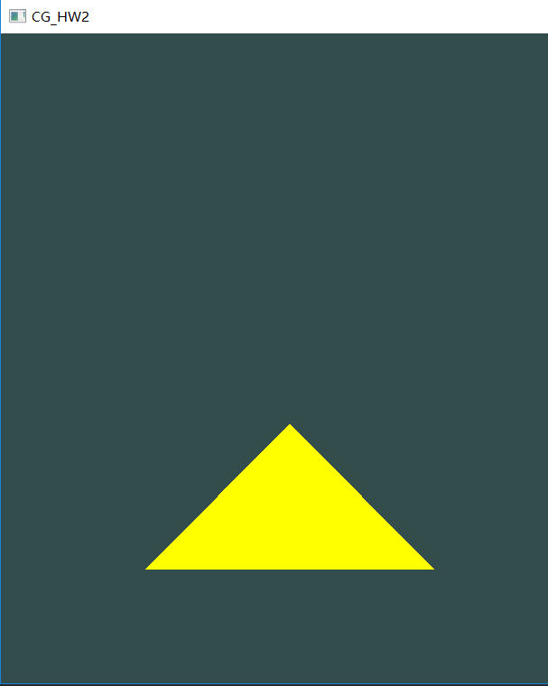
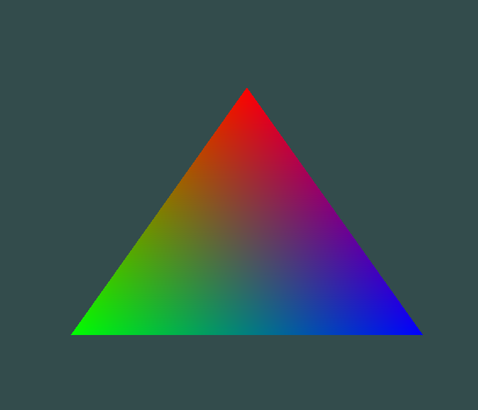
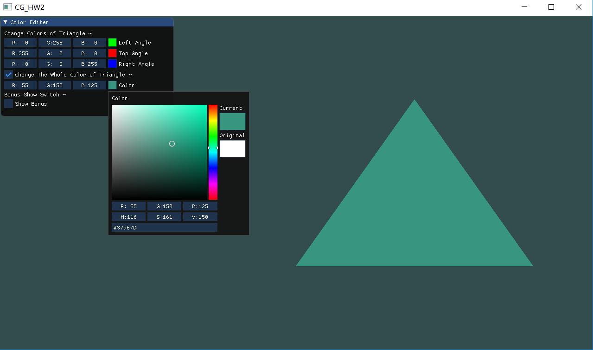
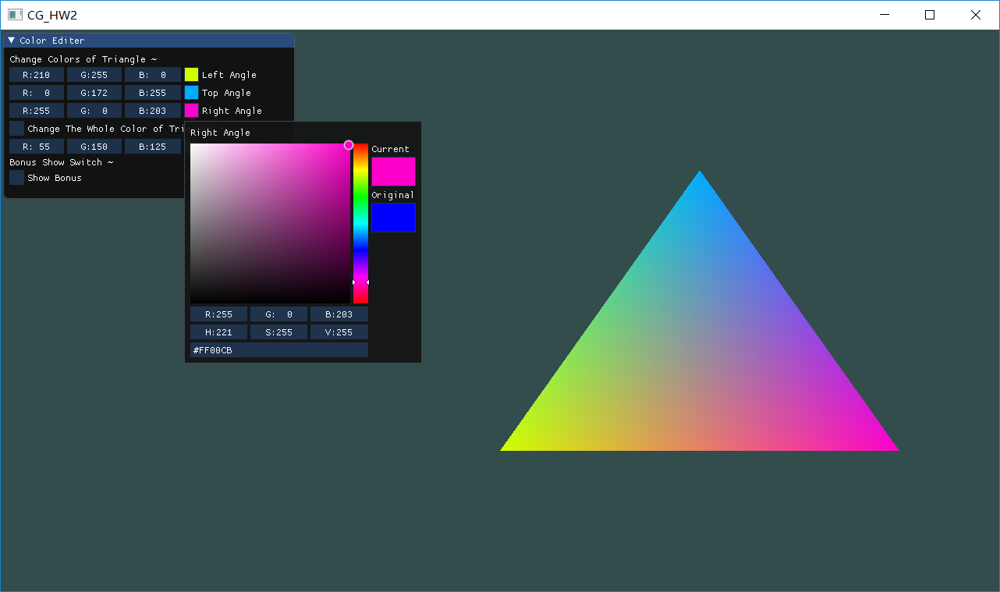
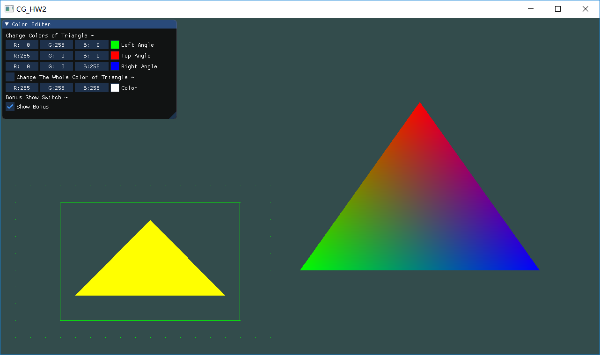

# 计算机图形学 - Homework 2

### 姓名：陈明亮

### 学号：16340023

> Basic 部分

## 一、 使用`OpenGL3.3 + GLFW`绘制简单三角形

### 1. OpenGL图形渲染原理

* 由于在`OpenGL`中的物体描述都产生在3D空间中，然而电脑屏幕窗口却是2D空间，故`OpenGL`的大部分工作都依赖于*图形渲染管线*，将3D数组转换为2D像素数组，从而进一步在显示屏上展现给用户。

* 图形渲染管线接受一组3D坐标，然后把它们转变为你屏幕上的有色2D像素输出。图形渲染管线可以被划分为几个阶段，每个阶段将会把前一个阶段的输出作为输入。所有这些阶段都是高度专门化的，并且很容易并行执行。正是由于它们具有并行执行的特性，当今大多数显卡都有成千上万的小处理核心，它们在`GPU`上为每一个*渲染管线*阶段运行各自的小程序，从而在图形渲染管线中快速处理你的数据。这些小程序叫做着色器`Shader`。

  ​

### 2. 绘制三角形的原理

* 为了表示一个三角形，我们需要定义三个顶点在`OpenGL`图形空间内部的位置坐标值，以及相应的顶点属性`Vertex Attributes`，属性值可以定义为我们需要使用的相应数值。

  ```c++
  float vertices[] = {
      -0.5f, -0.5f, 0.0f,
       0.5f, -0.5f, 0.0f,
       0.0f,  0.5f, 0.0f
  };
  ```

  ​

* 图形渲染管线包括：顶点着色器`Vertex Shader`与片段着色器`Fragment Shader`，结合之前定义的顶点数据，我们将它作为输入发送给图形渲染管线的顶点着色器，主程序中建立顶点缓冲对象(Vertex Buffer Object, VBO)管理这些内存，在GPU内存中存储大量的顶点，使用`OpenGL`提供的VBO操作函数，可以将顶点数据从显存中读取到缓冲中。

  ```c++
  unsigned int VBO;
  glGenBuffers(1, &VBO);
  glBindBuffer(GL_ARRAY_BUFFER, VBO);
  glBufferData(GL_ARRAY_BUFFER, sizeof(vertices), vertices, GL_STATIC_DRAW);
  ```

  ​

* 顶点数组对象(Vertex Array Object, VAO)可以像顶点缓冲对象那样被绑定，任何随后的顶点属性调用都会储存在这个VAO中。这样的好处就是，当配置顶点属性指针时，你只需要将那些调用执行一次，之后再绘制物体的时候只需要绑定相应的VAO就行了。这使在不同顶点数据和属性配置之间切换变得非常简单，只需要绑定不同的VAO就行了。刚刚设置的所有状态都将存储在VAO中。

  ```c++
  unsigned int VAO;
  glGenVertexArrays(1, &VAO);
  glBindVertexArray(VAO);
  ```

  ​

* 顶点着色器(Vertex Shader)是几个可编程着色器中的一个。如果我们打算做渲染的话，现代OpenGL需要我们至少设置一个顶点和一个片段着色器，同时也需要使用着色器语言GLSL进行顶点着色器的内容编写。

  ```c++
  #version 330 core
  layout (location = 0) in vec3 aPos;

  void main(){
      gl_Position = vec4(aPos.x, aPos.y, aPos.z, 1.0);
  }
  ```

  ​

* 片段着色器(Fragment Shader)是第二个也是最后一个我们打算创建的用于渲染三角形的着色器。片段着色器所做的是计算像素最后的颜色输出。片段着色器只需要一个输出变量，这个变量是一个4分量向量，它表示的是最终的输出颜色，我们应该自己将其计算出来。

  ```c++
  #version 330 core
  out vec4 FragColor;

  void main(){
      FragColor = vec4(1.0f, 0.5f, 0.2f, 1.0f);
  } 
  ```

  ​

* 编写完着色器的相关程序之后，我们需要将着色器链接起来，将前个着色器的输出导向到下个着色器的输入，链接之后即激活相关的着色器对象。

  ```c++
  // Create shader
  unsigned int shaderProgram;
  shaderProgram = glCreateProgram();
  // Link shader
  glAttachShader(shaderProgram, vertexShader);
  glAttachShader(shaderProgram, fragmentShader);
  glLinkProgram(shaderProgram);
  // Activate shader
  glUseProgram(shaderProgram);
  // Delete shader
  glDeleteShader(vertexShader);
  glDeleteShader(fragmentShader);
  ```

  ​

### 3. 绘制固定坐标，颜色的三角形

* 首先自定义三角形的属性数组，以及相关颜色属性

  ```c++
  float vertices[] = {
      -0.25f, -0.65f, 0.0f, 1.0f, 1.0f, 0.0f,
      -0.75f, -0.65f, 0.0f,  1.0f, 1.0f, 0.0f,
      -0.5f, -0.2f, 0.0f,  1.0f, 1.0f, 0.0f
  }
  ```

  ​

* 编写着色器程序，并进行`while`循环内的三角形渲染

  ​

* 最终结果图

  


## 二、 绘制顶点分别为`红绿蓝`的三角形，解释原理

* 绘制结果：

  ​

* 原理分析：

  1. 结合顶点着色器程序，我们重新对之前的顶点属性数组`vertices`进行修改，使得三角形的三个顶点位置坐标之后，紧跟着其对应的颜色三维数组，以达到不同顶点渲染不同的颜色的效果。为实现此功能，需要读取对应位置上的三维颜色向量`Color`，并将其传给之后的片段着色器进行输出。

     ```c++
     // New Vertices
     // OpenGL Drawing Vertex array
     GLfloat vertices[] = {
         // Left Part (Three float numbers are locations -- (x, y, z))
         // Right Part (Three float numbers are colors -- (r, g, b))
         // First Triangle
         0.8f, -0.5f, 0.0f,  0.0f, 0.0f, 1.0f,
         0.0f, -0.5f, 0.0f,  1.0f, 0.0f, 0.0f,
         0.4f,  0.5f, 0.0f,  0.0f, 1.0f, 0.0f,
     }
     ```

     ```c++
     // New Vertex shader
     #version 330 core

     // Input vertex data, different for all executions of this shader.
     layout (location = 0) in vec3 Position;
     layout (location = 1) in vec3 inColor;

     // Output one color to fragment shader
     out vec3 outColor;

     void main(){
         gl_Position = vec4(Position, 1.0);
         outColor = inColor;
     }
     ```

     ​

  2. 更新完对应的顶点着色器的功能，以及顶点属性数据，因为我们添加了另一个顶点属性，并且更新了VBO的内存，我们就必须重新配置顶点属性指针。更新后的VBO内存中的数据现在看起来像这样：

     

     知道了现在使用的布局，我们就可以使用glVertexAttribPointer函数更新顶点格式，由于我们现在有了两个顶点属性，我们不得不重新计算**步长**值。为获得数据队列中下一个属性值（比如位置向量的下个`x`分量）我们必须向右移动6个float，其中3个是位置值，另外3个是颜色值。这使我们的步长值为6乘以float的字节数。

     ```c++
     // 位置属性
     glVertexAttribPointer(0, 3, GL_FLOAT, GL_FALSE, 6 * sizeof(float), (void*)0);
     glEnableVertexAttribArray(0);
     // 颜色属性
     glVertexAttribPointer(1, 3, GL_FLOAT, GL_FALSE, 6 * sizeof(float), (void*)(3* sizeof(float)));
     glEnableVertexAttribArray(1);
     ```

     ​

## 三、 使用`ImGUI`为三角形添加可改变颜色的`GUI`

* 实现结果：

  ​


* 原理分析：

  1. 通过引入`ImGui`这个轻量级的C++图形化用户界面库，我们可以通过调用该库中的相关API，进行GUI界面的开发和整体构建。此处在原有的三角形基础上，引入了`ImGUI::ColorEdit3`组件，并将其与三角形自身的颜色绑定，实现动态调整三角形颜色的功能。

     ```c++
     // New OpenGL3 frame
     ImGui_ImplOpenGL3_NewFrame();
     ImGui_ImplGlfw_NewFrame();
     ImGui::NewFrame();
     // Define ImGUI window elements
     {
         ImGui::Begin("Color Editer");
         ImGui::Text("Change Colors of Triangle ~");
         ImGui::ColorEdit3("Left Angle", (float*)&colors[1], 1);
         ImGui::ColorEdit3("Top Angle", (float*)&colors[2], 1);
         ImGui::ColorEdit3("Right Angle", (float*)&colors[0], 1);

         ImGui::Checkbox("Change The Whole Color of Triangle ~", &drawAll);
         ImGui::ColorEdit3("Color", (float*)&color_all, 1);
         
         ImGui::End();
     }

     // Render ImGUI (Of coruse in a loop)
     ImGui::Render();
     ImGui_ImplOpenGL3_RenderDrawData(ImGui::GetDrawData());
     ```

     此段代码是`ImGUI`整体的启动，组件添加，帧渲染的大致过程，实际中帧渲染应当放在整个OpenGL窗口的渲染循环中，此处由于篇幅限制没有全部贴出。可以看到OpenGL3必须结合GLFW，实现对`ImGUI`帧的初始化，才可以正常引入其各项功能；之后的组件定义部分则是自由发挥的时间，用法较为简单，对于颜色编辑器只需要引入自定义变量进行绑定即可，绑定之后则需要我们修改顶点颜色数据，达到实时更新三角形颜色的功能。

     ```c++
     for (int i = 0; i < 3; i++) {
         vertices[6 * i + 3] = color_all.x;
         vertices[6 * i + 4] = color_all.y;
         vertices[6 * i + 5] = color_all.z;
     }
     ```

     更新之后的顶点属性数据，再次存储进VBO对象中，结合`glDrawElements`函数进行渲染，即可实现不同颜色之间的变换。

     ​

> Bonus 部分

## 四、 增加`GUI`功能

* 实现结果：

  


* 功能分析：

  在原有的`ImGUI`的基础上，不仅实现了可改变当前三角形颜色的功能，此处还引入了分别更改三角形三个不同顶点对象对应的颜色的功能，具体操作为：

  * 定义颜色存储向量`Colors`内部存储三个三维数据，分别与新建的三个`ColorEdit3`组件绑定，对应于左，上，右顶点的三维颜色数组

  * 引入`CheckBox`组件，将修改全局颜色模式，与分别修改对应顶点的颜色模式分开，达到共存不干扰的状态。若`CheckBox`点击确定，则为修改全局颜色模式，否则则为分别修改颜色模式

    ```c++
    ImGui::Text("Change Colors of Triangle ~");
    ImGui::ColorEdit3("Left Angle", (float*)&colors[1], 1);
    ImGui::ColorEdit3("Top Angle", (float*)&colors[2], 1);
    ImGui::ColorEdit3("Right Angle", (float*)&colors[0], 1);

    ImGui::Checkbox("Change The Whole Color of Triangle ~", &drawAll);
    ImGui::ColorEdit3("Color", (float*)&color_all, 1);
    ```

    ​

  * 通过`CheckBox`组件绑定的模式变量`drawAll`，在OpenGL的主渲染循环中，通过判断其布尔值，决定当前顶点属性数组`vertices`内部数据的修改，如下：

    ```c++
    // Check whether draw all into one color
    if (drawAll) {
        for (int i = 0; i < 3; i++) {
            vertices[6 * i + 3] = color_all.x;
            vertices[6 * i + 4] = color_all.y;
        	vertices[6 * i + 5] = color_all.z;
        }
    }
    else {
        for (int i = 0; i < 3; i++) {
            vertices[6 * i + 3] = colors[i].x;
            vertices[6 * i + 4] = colors[i].y;
            vertices[6 * i + 5] = colors[i].z;
        }
    }
    ```

    ​


## 五、 使用`EBO`绘制多个三角形，以及点、 线等物体

* 实现结果：

  


* 原理解释：

  1. 首先此处除了之前的三角形之外，还绘制了另一个三角形，以及相关的线，点，包围在三角形的外边。同时我们对`ImGUI`窗口的组件进行了添加，增加了`Show Bonus`选项的`CheckBox`，当勾选时显示下边的三角形、线、点对象，否则使其消失。

     ​

  2. 绘制另一个三角形的过程结合了`EBO(Element Buffer Object)`索引缓冲对象，新建EBO对象，同时在原本的顶点数据数组`vertices`中，加入第二个三角形的顶点数据，同时建立索引数组`indices`。

     ```c++
     // Double triangles indices
     unsigned int indices[] = {
         0, 1, 2,
         3, 4, 5
     };
     ```

     ​

  3. 与`VBO`类似，我们先绑定EBO然后用`glBufferData`把索引复制到缓冲里。同样，和`VBO`类似，我们会把这些函数调用放在绑定和解绑函数调用之间，只不过这次我们把缓冲的类型定义为`GL_ELEMENT_ARRAY_BUFFER`，要注意的是，我们传递了`GL_ELEMENT_ARRAY_BUFFER`当作缓冲目标。最后一件要做的事是用`glDrawElements`来替换`glDrawArrays`函数，来指明我们从索引缓冲渲染。使用`glDrawElements`时，我们会使用当前绑定的索引缓冲对象中的索引进行绘制：

     ```c++
     unsigned int EBO;
     glGenBuffers(1, &EBO);
     glBindBuffer(GL_ELEMENT_ARRAY_BUFFER, EBO);
     glBufferData(GL_ELEMENT_ARRAY_BUFFER, sizeof(indices), indices, GL_STATIC_DRAW);
     glBindBuffer(GL_ELEMENT_ARRAY_BUFFER, EBO);
     glDrawElements(GL_TRIANGLES, 6, GL_UNSIGNED_INT, 0);
     ```

     ​

  4. 此处的`Show Bonus`显示的`CheckBox`组件与`showBonus`变量的布尔值绑定，同时在OpenGL主循环渲染中，检测此变量的布尔值是否为`true`，若是则执行正常的渲染，否则不渲染，以达到控制显示的效果：

     ```c++
     // Draw lines, points and triangles
     if (showBonus) {
         glDrawElements(GL_TRIANGLES, 6, GL_UNSIGNED_INT, 0);
         glDrawArrays(GL_LINES, 6, 8);
         glDrawArrays(GL_POINTS, 10, 53);
     }
     else {
     	glDrawElements(GL_TRIANGLES, 3, GL_UNSIGNED_INT, 0);
     }
     ```

     ​