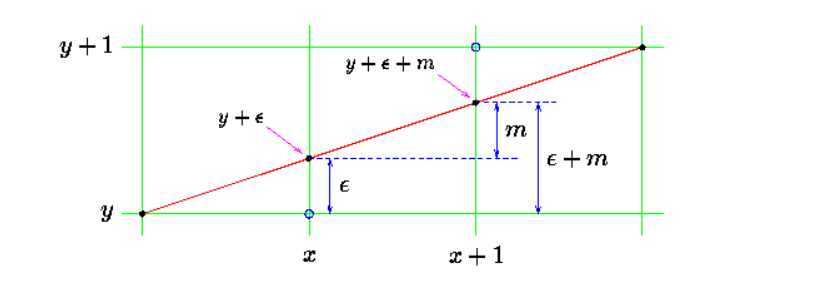
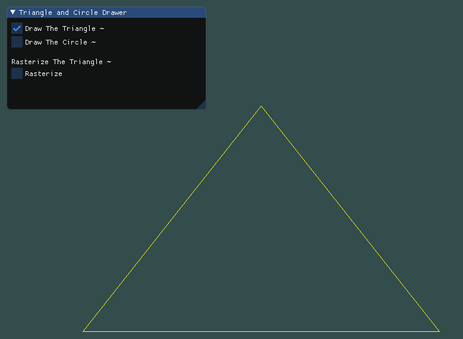
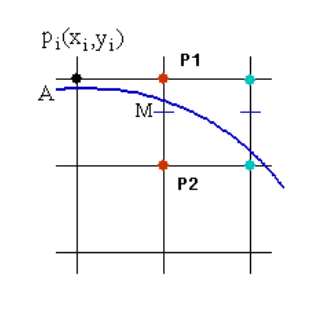
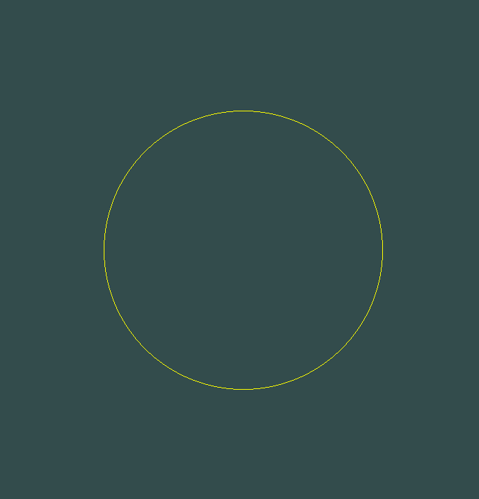
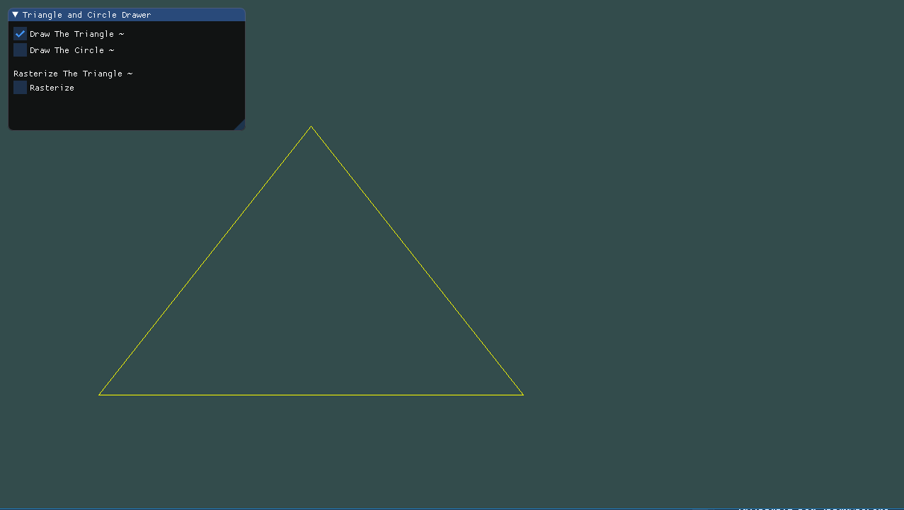
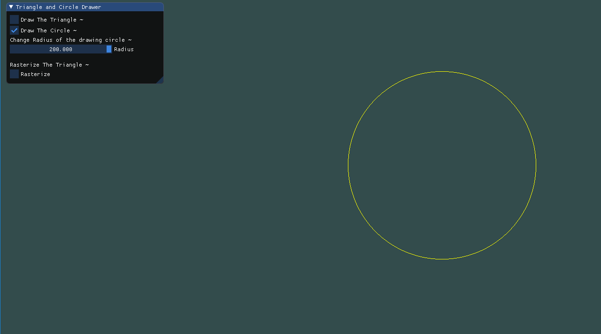
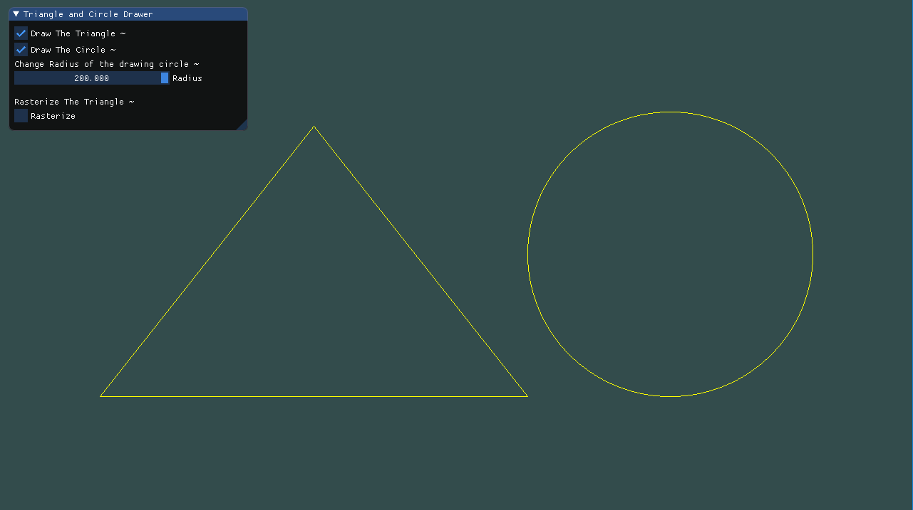
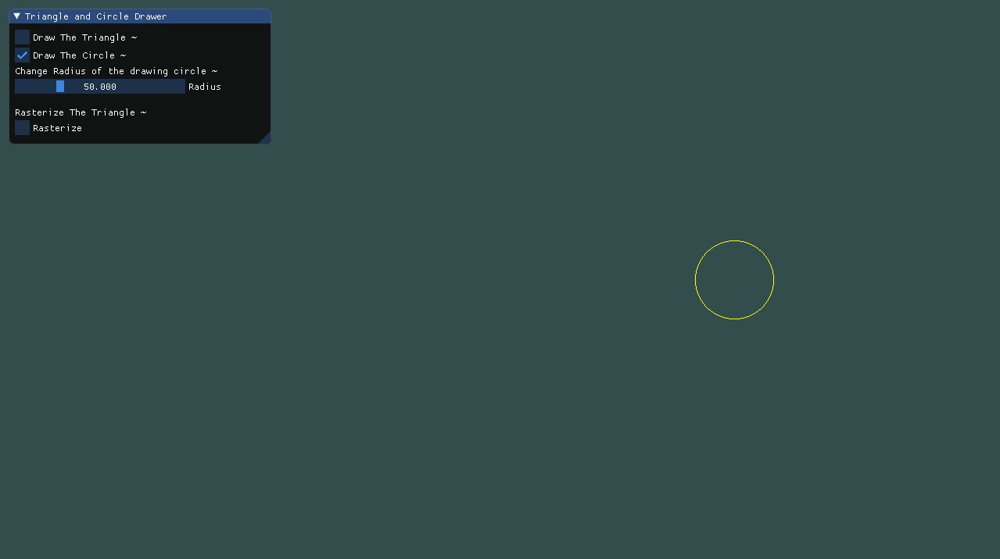
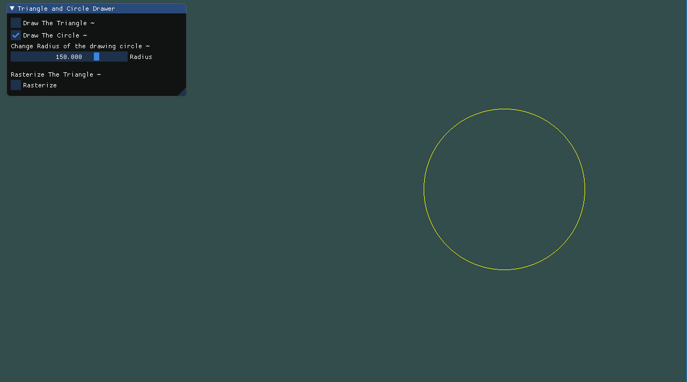
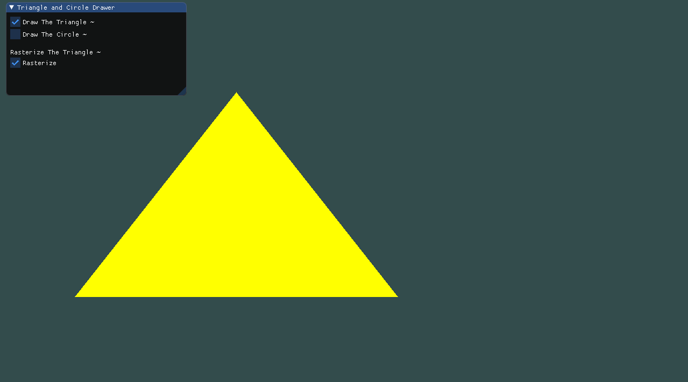

# 计算机图形学 - Homework 3

### 姓名：陈明亮

### 学号：16340023

> Basic 部分

## 一、使用`Bresenham`算法绘制三角形

### 1. `Bresenham`算法步骤

* Bresenham算法使用整数运算，进行直线的扫描转换，大大提高了算法的运行效率。使用该算法进行三角形的绘制，首先我们需要利用算法思想分别进行直线的绘制，当然`Bresenham`算法为光栅化的直线绘制算法，是指用像素点来模拟直线，当像素点之间距离很短时，视觉上就会认为直线绘制成功了。

  ​

* 首先`Bresenham`直线绘制算法要求给定起点和终点的坐标，分别为`(x0, y0)`和`(x1, y1)`。算法第一步必须为绘制给定的起点，在函数实现中即为将起点`push`进结果帧队列中，然后计算以下常量：
  $$
  \Delta X = X_1 - X_0， \Delta Y = Y_1 - Y_0，p = 2\Delta Y - \Delta X
  $$
  然后我们根据该直线的斜率分别进行不同方向的点坐标求解，当斜率`k`小于1时，在`X`方向上进行路径绘制，检测常量`p`的正负性，当`p`为正数时，绘制的顶点坐标必须加上`y`方向变换向量(通常设为`1`或`-2`)，然后结合递进公式对常量`p`进行更新，同时将顶点坐标推入结果中，迭代直到点与终点重合。

  

  ​

* 在本人实现的`Bresenham`算法中，均采用整数运算，定义绘制直线函数，并且返回整数`vector`，存储结果顶点坐标对，具体代码如下：

  ```c++
  // Bresenham algorithm
  vector<int> Bresenham(int x0, int y0, int x1, int y1){
  	vector<int> points;
  	// Push origin begin points
  	points.push_back(x0);
  	points.push_back(y0);
  	// Direction checking
  	int dx = x1 - x0, dy = y1 - y0;
  	int direct_x = dx > 0 ? 1 : -1, direct_y = dy > 0 ? 1 : -1;
  	if(dx < 0) dx = -dx;
  	if(dy < 0) dy = -dy;

  	if(abs(dx)> abs(dy)){
  		int p = 2 * dy - dx, x = x0, y = y0;
  		// Repeating loop
  		while(x != x1){
  			points.push_back(x);
  			points.push_back(y);
  			if(p> 0){
  				y += direct_y;
  				p = p + 2 * dy - 2 * dx;
  			}else {
  				p = p + 2 * dy;
  			}
  			x += direct_x;
  		}
  	}else {
  		int p = 2 * dx - dy, x = x0, y = y0;
  		while(y != y1){
  			points.push_back(x);
  			points.push_back(y);
  			if(p > 0){
  				x += direct_x;
  				p = p + 2 * dx - 2 * dy;
  			}else {
  				p = p + 2 * dx;
  			}
  			y += direct_y;
  		}
  	}
  	// Push origin End points
  	points.push_back(x1);
  	points.push_back(y1);
  	return points;
  }
  ```

  ​
### 2. Bresenham绘制三角形

* 当我们能够使用`Bresenham`算法进行直线的绘制，此时对于三角形的绘制也变得十分简单，只需要将三角形的三个顶点坐标，分别两两传入以上函数，便可以获取每一条边的直线点存储`vector`，用于在`OpenGL`窗口内部进行绘制：

  ```c++
  void drawTriangleWithBresenham(int x0,int y0,int x1,int y1,int x2,int y2,vector<int>& points){
  	vector<vector<int>> edges;
  	// Build triangle with three pairs of points, using Bresenham algorithm
  	edges.push_back(Bresenham(x0, y0, x1, y1));
  	edges.push_back(Bresenham(x1, y1, x2, y2));
  	edges.push_back(Bresenham(x2, y2, x0, y0));
  	// Make points
  	for(int i=0; i<edges.size(); i++){
  		for(int j=0; j<edges[i].size(); j++){
  			points.push_back(edges[i][j]);
  		}
  	}
  }
  ```

  ​

* 但是经过输出之后，发现由于`Bresenham`使用整数运算，所以设备上显示的点均为整数坐标上的点，没办法提供连续的直线观感，整体是呈离散的直线点。为了提升用户体验以及直线模拟绘制程度，此处针对于`Bresenham`算法的整数结果，我们在`OpenGL`渲染流程中对其进行浮点数化(但是直线算法本身仍然是整数运算)，根据当前用户窗口大小，进行坐标的相对转换：

  ```c++
  void produceVertices(vector<int>& points, float* vertices){
  	for(int i=0; i<points.size() / 2; i++){
  		// Points position
  		vertices[i * 6 + 0] = (float)points[i * 2 + 0] / (float)relative_width;
  		vertices[i * 6 + 1] = (float)points[i * 2 + 1] / (float)relative_height;
  		vertices[i * 6 + 2] = 0.0f;
  		// Points color -- Yellow
  		vertices[i * 6 + 3] = 1.0f;
  		vertices[i * 6 + 4] = 1.0f;
  		vertices[i * 6 + 5] = 0.0f;
  	}
  }
  ```

  此处的`vertices`数组仍然是前三个元素存储`x, y, z`大小，其中`relative_width, relative_height`分别为窗口的宽度和高度，数组的后三个元素为`R, G, B`值，此处颜色设置为黄色，显示为黄色边框的三角形

  ​

* 获取用于渲染的`vertices`数组，使用`GL_POINTS`进行直线点的绘制：

  ```c++
  float* vertices = new float[points.size() / 2 * 6];
  produceVertices(points, vertices);

  // Clear the screen
  glClearColor(0.2f, 0.3f, 0.3f, 1.0f);
  glClear(GL_COLOR_BUFFER_BIT);

  glUseProgram(programID);

  glBindBuffer(GL_ARRAY_BUFFER, VBO);
  glBufferData(GL_ARRAY_BUFFER, points.size() / 2 * 6 * sizeof(float), vertices, GL_STREAM_DRAW);

  // Position Attributes binding
  glBindBuffer(GL_ARRAY_BUFFER, VBO);
  glVertexAttribPointer(0, 3, GL_FLOAT, GL_FALSE, 6 * sizeof(float), (void*)0);
  glEnableVertexAttribArray(0);
  // Color Attributes binding
  glVertexAttribPointer(1, 3, GL_FLOAT, GL_FALSE, 6 * sizeof(float), (void*)(3 * sizeof(float)));
  glEnableVertexAttribArray(1);

  glDrawArrays(GL_POINTS, 0, points.size() / 2);
  ```

  ​

### 3. 三角形绘制结果




## 二、使用`Bresenham`算法绘制圆形

### 1. `Bresenham`绘制圆形算法

* 在计算机图形学中，圆形和直线一样，也存在在点阵输出设备上显示的问题，所以也需要一套光栅化扫描转换算法，使用浮点数运算的算法为中点画圆法，然而此处我们为了提高计算效率，可以使用`Bresenham`算法对其进行优化调整。圆形的光栅化算法都基于圆的八分对称性，即只需要得到圆的八分之一绘制结果，其余部分可以通过对称性质得出。

  ​

* 中点画圆法图示

  

  构造判别函数：${F(x, y）= x^2 + y^2 – R^2}$

  当`F(x, y)`= 0，表示点在圆上，当`F(x, y)`> 0，表示点在圆外，当`F(x, y)`< 0，表示点在圆内。

  假设`M`是`P1`和`P2`的中点，则`M`的坐标是`(xi + 1, yi – 0.5)`，当`F(xi + 1, yi – 0.5)`< 0时，`M`点在圆内，说明`P1`点离实际圆弧更近，应该取`P1`作为圆的下一个点。同理分析，当`F(xi + 1, yi – 0.5)`> 0时，`P2`离实际圆弧更近，应取`P2`作为下一个点。当`F(xi + 1, yi – 0.5)`= 0时，`P1`和`P2`都可以作为圆的下一个点，算法约定取`P2`作为下一个点。

  经过倒推计算，判别式可以推出生成圆形曲线的判别式，在圆形为原点的中点画圆法中，判别式为：
  $$
  D(0) = 1.25 - R，D(n+1) = D(n) + 2 * X_i + 3
  $$
  ​

* 中点画圆算法中，计算过程均采用浮点运算，影响圆的生成效率，此处我们结合`Bresenham`算法，将计算过程规定为整数运算，将判别式的计算放大两倍，采用`3 - 2R`的初始值改进算法，强制类型为整数，具体实现如下：

  ```c++
  void drawCircleWithBresenham(int x0, int y0, int radius, vector<int>& points){
  	int x = 0, y = radius, dis = 3 - 2 * radius;
  	const int multiper = 4, pos_len = 10, neg_len = 6;
  	circlePlot(x0, y0, x, y, points);
  	// Drawing loop
  	while(x < y){
  		if(dis < 0){
  			dis += multiper * x + neg_len;
  		}else {
  			dis += multiper * (x - y) + pos_len;
  			--y;
  		}
  		++x;
  		circlePlot(x0, y0, x, y, points);
  	}
  }
  ```

  此处的`circlePlot`函数即为圆的八分性构造，实际上即为输入对应起点与初始值，进行一部分的圆点构造，然后根据八分对称原理进行填充：

  ```c++
  void circlePlot(int src_x, int src_y, int x, int y, vector<int>& points){
  	// Divide into eight parts to search points to build a circle
  	points.push_back(src_x + x); points.push_back(src_y + y);
  	points.push_back(src_x + x); points.push_back(src_y - y);
  	points.push_back(src_x - x); points.push_back(src_y + y);
  	points.push_back(src_x - x); points.push_back(src_y - y);
  	points.push_back(src_x + y); points.push_back(src_y + x);
  	points.push_back(src_x + y); points.push_back(src_y - x);
  	points.push_back(src_x - y); points.push_back(src_y + x);
  	points.push_back(src_x - y); points.push_back(src_y - x);
  }
  ```

  ​

* 同样的，由于算法结果均为整数点，此处结合`produceVertices`将点坐标进行浮点数化，最终获取数组再进行渲染，这样既保证算法内部的整数运算，也保证了输出的连续化。


### 2. 调整圆形的半径大小

* 调整圆的半径大小，只需要结合`ImGUI`，添加组件`SliderFloat`，将其值与圆的半径进行绑定即可：

  ```c++
  if (drawCircle) {
      ImGui::Text("Change Radius of the drawing circle ~");
      ImGui::SliderFloat("Radius", &radius, 0.0f, 200.0f);
  }

  // Draw Circle
  if(drawCircle){
      drawCircleWithBresenham(300, 0, (int)radius, points);
  }
  ```

  ​

### 3. 圆形绘制结果




## 三、添加`GUI`功能

### 1. 三角形与圆形选择显示菜单

* 利用`ImGUI`添加`CheckBox`组件，并且将组件的值与`bool`变量绑定，在进行渲染时对布尔变量进行判定，此处分为`drawTriangle`和`drawCircle`，分别进行`if`语句判定，为`true`则进行渲染，否则暂停渲染。

  ```c++
  ImGui::Begin("Triangle and Circle Drawer");
  ImGui::Checkbox("Draw The Triangle ~", &drawTriangle);
  ImGui::Checkbox("Draw The Circle ~", &drawCircle);
  ```

  ```c++
  // Draw Triangle
  if(drawTriangle){
      if(showBonus){
      	points = rasterizeTriangle(-200, 180, 100, -200, -500, -200);
      }else {
      	drawTriangleWithBresenham(-200, 180, 100, -200, -500, -200, points);
      }
  }
  // Draw Circle
  if(drawCircle){
  	drawCircleWithBresenham(300, 0, (int)radius, points);
  }
  ```


* 效果展示：

  1. 只显示三角形

     

  2. 只显示圆形

     

  3. 三角形和圆形同时显示

     


### 2. 增加圆形半径调整栏

* 增加`SlideFloat`组件，与圆形绘制半径绑定，可以动态改变绘制的圆半径大小

  ```c++
  if (drawCircle) {
      ImGui::Text("Change Radius of the drawing circle ~");
      ImGui::SliderFloat("Radius", &radius, 0.0f, 200.0f);
  }
  ```

  ​

* 效果展示：

  1. 圆半径为50

     

     ​

  2. 圆半径为150

     

### 3. 光栅化选择显示菜单

* 光栅化的显示作为加分项，我们在`ImGUI`组件的最后添加是否展示三角形填充光栅化的选项，选中则填充，否则保持原始状态

  ```c++
  ImGui::Text("\nRasterize The Triangle ~");
  ImGui::Checkbox("Rasterize", &showBonus);
  ```

  ```c++
  // Draw Triangle
  if(drawTriangle){
      if(showBonus){
      	points = rasterizeTriangle(-200, 180, 100, -200, -500, -200);
      }else {
      	drawTriangleWithBresenham(-200, 180, 100, -200, -500, -200, points);
      }
  }
  ```

  ​


> Bonus 部分

## 四、 使用三角形光栅算法，填充三角形

### 1. 三角形光栅化填充算法原理

* 三角形光栅化填充算法的步骤为：

  1. 获取三角形三条边的直线方程，这可以根据两点式进行计算，然后再将其转换为一般式方程，即`Ax+By+C = 0`

  2. 将三角形`中心化`，实际上就是通过遍历三角形边框上的点，对于某一条直线的方程，如果三角形边框某一点的坐标`(X, Y)`使得该直线的一般式方程左边小于零，那么我们则需要改变其一般式方程的系数(一般为乘以-1)，来达到对于三角形内部的每一点，代入三角形三条边的直线方程所得值都大于等于零。

  3. 获取三角形的外接矩形，遍历该矩形内部的点，如果点在三角形内部，则加入渲染点队列，否则不添加。

     ​


* 具体算法实现为：

  ```c++
  vector<int> rasterizeTriangle(int x0, int y0, int x1, int y1, int x2, int y2){
  	int max_x = max(x0, x1, x2),
  		min_x = min(x0, x1, x2),
  		max_y = max(y0, y1, y2),
  		min_y = min(y0, y1, y2);
  	int cen_x = (max_x - min_x) / 2, cen_y = (max_y - min_y) / 2;
  	// Build lines
  	vector<vector<int>> lines;
  	lines.push_back(getLineEquation(x0, y0, x1, y1));
  	lines.push_back(getLineEquation(x1, y1, x2, y2));
  	lines.push_back(getLineEquation(x2, y2, x0, y0));
  	// Centerlize lines
  	int temp_arr[3][2] = {
  		{x2, y2}, {x1, y1}, {x0, y0}
  	};
  	for(int i=0; i<3; i++){
  		int temp = lines[i][0] * temp_arr[i][0] + 
  				   lines[i][1] * temp_arr[i][1] +
  				   lines[i][2];
  		if(temp < 0){
  			for(int j=0; j<lines[i].size(); j++){
  				lines[i][j] *= -1;
  			}
  		}
  	}
  	// Generate Pixel results
  	vector<int> result;
  	for (int x = min_x; x <= max_x; x++) {
  		for (int y = min_y; y <= max_y; y++) {
  			bool inside = true;
  			for (int i = 0; i< 3; i++) {
  				int temp = lines[i][0] * x + lines[i][1] * y + lines[i][2];
  				if (temp < 0) {
  					inside = false;
  					break;
  				}
  			}
  			if (inside) {
  				result.push_back(x);
  				result.push_back(y);
  			}
  		}
  	}
  	return result;
  }
  ```

  此处的`getLineEquation()`函数负责利用两点坐标，计算出一般式方程的系数，传回给填充函数进行使用，算法进行三角形中心化只需要判断某点代入方程的值是否都大于零，即可获取所有三角形内部的点，返回渲染像素点数组。


* 渲染过程与上文中的基本相同，实际上也是通过获取`vertices`数组，进行浮点数化，然后使用`GL_POINTS`进行绘制：

  ```c++
  // Draw Triangle
  if(drawTriangle){
      if(showBonus){
      	points = rasterizeTriangle(-200, 180, 100, -200, -500, -200);
      }else {
      	drawTriangleWithBresenham(-200, 180, 100, -200, -500, -200, points);
      }
  }

  glDrawArrays(GL_POINTS, 0, points.size() / 2);
  ```

  ​

### 2. 三角形填充结果

