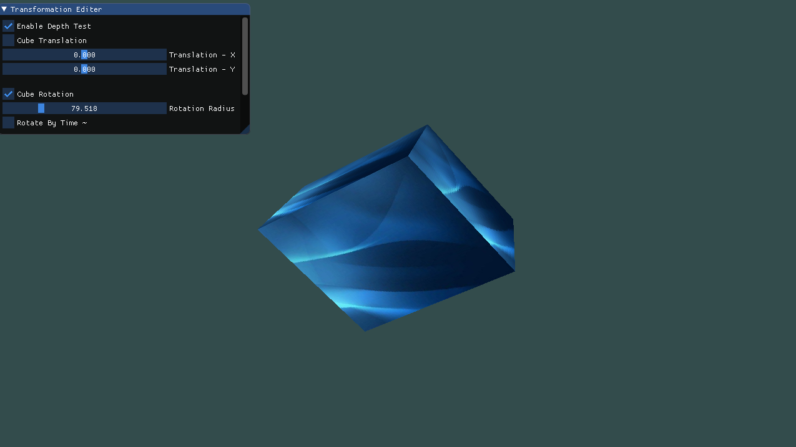

# 计算机图形学 - Homework 4

### 姓名：陈明亮

### 学号：16340023


> Basic 部分

## 一、画一个边长为4，中心位置为原点的立方体，并分别启动和关闭深度测试，查看区别，分析原因
### 1. 绘制符合条件的正方体

* 对于正方体的绘制，首先需要做的一步就是设置顶点数组，将立方体的每个顶点坐标记录在数组内部，由于接下来使用的绘制途径为`GL_TRIANGLES`，所以顶点数组内部根据三角形顶点的设置，来逐一完成立方体每个面的填充。在设置的顶点数组中，每六个顶点坐标表示一组，一组坐标构成一个面，总共需要36个顶点坐标对。

  ```c++
  // OpenGL Drawing Vertex array
  	GLfloat vertices[] = {
  		-0.4f, -0.4f, -0.4f, 0.0f, 0.0f,
  		0.4f, -0.4f, -0.4f, 1.0f, 0.0f,
  		0.4f, 0.4f, -0.4f, 1.0f, 1.0f,
  		0.4f, 0.4f, -0.4f, 1.0f, 1.0f,
  		-0.4f, 0.4f, -0.4f, 0.0f, 1.0f,
  		-0.4f, -0.4f, -0.4f, 0.0f, 0.0f,

  		-0.4f, -0.4f, 0.4f, 0.0f, 0.0f,
  		0.4f, -0.4f, 0.4f, 1.0f, 0.0f,
  		0.4f, 0.4f, 0.4f, 1.0f, 1.0f,
  		0.4f, 0.4f, 0.4f, 1.0f, 1.0f,
  		-0.4f, 0.4f, 0.4f, 0.0f, 1.0f,
  		-0.4f, -0.4f, 0.4f, 0.0f, 0.0f,

  		-0.4f, 0.4f, 0.4f, 1.0f, 0.0f,
  		-0.4f, 0.4f, -0.4f, 1.0f, 1.0f,
  		-0.4f, -0.4f, -0.4f, 0.0f, 1.0f,
  		-0.4f, -0.4f, -0.4f, 0.0f, 1.0f,
  		-0.4f, -0.4f, 0.4f, 0.0f, 0.0f,
  		-0.4f, 0.4f, 0.4f, 1.0f, 0.0f,

  		0.4f, 0.4f, 0.4f, 1.0f, 0.0f,
  		0.4f, 0.4f, -0.4f, 1.0f, 1.0f,
  		0.4f, -0.4f, -0.4f, 0.0f, 1.0f,
  		0.4f, -0.4f, -0.4f, 0.0f, 1.0f,
  		0.4f, -0.4f, 0.4f, 0.0f, 0.0f,
  		0.4f, 0.4f, 0.4f, 1.0f, 0.0f,

  		-0.4f, -0.4f, -0.4f, 0.0f, 1.0f,
  		0.4f, -0.4f, -0.4f, 1.0f, 1.0f,
  		0.4f, -0.4f, 0.4f, 1.0f, 0.0f,
  		0.4f, -0.4f, 0.4f, 1.0f, 0.0f,
  		-0.4f, -0.4f, 0.4f, 0.0f, 0.0f,
  		-0.4f, -0.4f, -0.4f, 0.0f, 1.0f,

  		-0.4f, 0.4f, -0.4f, 0.0f, 1.0f,
  		0.4f, 0.4f, -0.4f, 1.0f, 1.0f,
  		0.4f, 0.4f, 0.4f, 1.0f, 0.0f,
  		0.4f, 0.4f, 0.4f, 1.0f, 0.0f,
  		-0.4f, 0.4f, 0.4f, 0.0f, 0.0f,
  		-0.4f, 0.4f, -0.4f, 0.0f, 1.0f
  	};
  ```

  ​

* 对于绘制后的顶点数组，结合之前作业的知识，需要将其绑定到顶点缓冲对象`VBO`中，设定顶点数组对象的可用性。

  ```c++
  // Vertex Buffer Object and Element Buffer Object
  GLuint VBO;
  glGenBuffers(1, &VBO);
  glBindBuffer(GL_ARRAY_BUFFER, VBO);
  glBufferData(GL_ARRAY_BUFFER, sizeof(vertices), vertices, GL_STATIC_DRAW);

  // Position Attributes binding
  glBindBuffer(GL_ARRAY_BUFFER, VBO);
  glVertexAttribPointer(0, 3, GL_FLOAT, GL_FALSE, 5 * sizeof(float), (void*)0);
  glEnableVertexAttribArray(0);
  // Color Attributes binding
  glVertexAttribPointer(1, 2, GL_FLOAT, GL_FALSE, 5 * sizeof(float), (void*)(3 * sizeof(float)));
  glEnableVertexAttribArray(1);
  ```


* 关于在`OpenGL`中显示正方体，我们需要使用`glm`库，同时修改`vertex_shader`顶点着色器代码，此处结合著名的`MVP`立体显示结构，在顶点着色器中添加`model`, `view`, `projection`矩阵，使得着色器结果为这些显示矩阵的乘积，乘以输入的顶点数组坐标，进行从平面坐标到立体坐标显示的变换。

  ```c++
  #version 330 core

  // Input vertex data, different for all executions of this shader.
  layout (location = 0) in vec3 Position;
  layout (location = 1) in vec2 inColor;

  uniform mat4 model;
  uniform mat4 view;
  uniform mat4 projection;

  // Output one color to fragment shader
  out vec2 outColor;

  void main(){
      gl_Position = projection * view * model * vec4(Position, 1.0);
      outColor = vec2(inColor.x, inColor.y);
  }
  ```

  ​

* 修改完着色器代码之后，我们需要做的就是在主程序中自定义相应的变换矩阵，然后输入到着色器内部进行渲染，此处的`model`为显示的核心模型，之后的平移、旋转、缩放变换基本上就是使用`glm`库函数对`model`进行各种基本变换，最终调用绘制函数即可正确显示绘制完成的正方形。

  ```c++
  glm::mat4 model;
  glm::mat4 view;
  glm::mat4 projection;
  glm::mat4 originModel = model;
  model = glm::mat4(4.0f);
  // View矩阵控制视图方向，此处从三维空间第一象限右上角进行正方体观看
  view = glm::lookAt(
      glm::vec3(2, 2, 2),
      glm::vec3(0, 0, 0),
      glm::vec3(0, 1, 0)
  );
  projection = glm::perspective(glm::radians(45.0f), (float)SCR_WIDTH / (float)SCR_HEIGHT,
  								0.1f, 1000.0f);
  								
  unsigned int viewLoc = glGetUniformLocation(programID, "view");
  glUniformMatrix4fv(viewLoc, 1, GL_FALSE, glm::value_ptr(view));
  unsigned int projectionLoc = glGetUniformLocation(programID, "projection");
  glUniformMatrix4fv(projectionLoc, 1, GL_FALSE, glm::value_ptr(projection));
  unsigned int modelLoc = glGetUniformLocation(programID, "model");
  glUniformMatrix4fv(modelLoc, 1, GL_FALSE, glm::value_ptr(model));

  glDrawArrays(GL_TRIANGLES, 0, 36);
  ```

  ​

* 初步绘制正方体的结果：

  


### 2. 为正方体加上图片纹理

* 由于以上显示的正方体颜色较为单一，此处引入`std_image.h`库文件，为绘制好的正方体加上纹理贴图，在加上纹理之前首先需要修改片段着色器，使其能够接受纹理数据的输入，并正常显示。

  ```c++
  #version 330 core

  // Ouput data
  out vec4 oColor;

  // Input data
  in vec2 outColor;

  uniform sampler2D texture1;

  void main(){
  	oColor = texture(texture1, outColor);
  }
  ```

  ​

* 返回主程序，`#include <std_image.h>`，通过调用库内部的读取图片数据，转换成纹理对象，输入给片段着色器进行渲染，最终呈现贴图之后的正方体。

  ```c++
  unsigned int texture1;
  glGenTextures(1, &texture1);
  glBindTexture(GL_TEXTURE_2D, texture1);

  stbi_set_flip_vertically_on_load(true);
  int width, height, nrChannels;
  unsigned char *data = stbi_load("blue.jpg", &width, &height, &nrChannels, 0);
  if (data)
  {
      glTexImage2D(GL_TEXTURE_2D, 0, GL_RGB, width, height, 0, GL_RGB, GL_UNSIGNED_BYTE, data);
      glGenerateMipmap(GL_TEXTURE_2D);
  }
  else
  {
      std::cout << "Failed to load texture" << std::endl;
  }
  glUseProgram(programID);
  glUniform1i(glGetUniformLocation(programID, "texture1"), 0);
  ```

  ​

* 加上图片纹理之后的正方体：

  


### 3. 添加`ImGui`选项，启动和关闭深度测试

* 引入`ImGui`库，首先添加启动和关闭深度测试的`CheckBox`组件

  ```c++
  // Define ImGUI window elements
  {
      ImGui::Begin("Transformation Editer");
      ImGui::Checkbox("Enable Depth Test", &enable);
      ImGui::End();
  }
  ```

  ​

* 根据组件绑定的`bool`变量，在渲染循环中进行判断，启动或者关闭深度测试，并且展示不同的结果

  ```C++
  if (enable) {
  	glEnable(GL_DEPTH_TEST);
  }
  else {
  	glDisable(GL_DEPTH_TEST);
  }
  ```

  ​

* 关闭深度测试：

  

  ​

* 开启深度测试：

  


### 4. 分析产生上述情况的原因

* 在关闭深度测试的情况下，我们可以明显看到正方体每个面的显示是不正常的，有一些面覆盖了原有的面，更仔细一点的说法就是，由于关闭了深度测试，深度属性剔除，所以距离比较远的面会覆盖掉距离近的面，导致正方体的整体显示比较奇怪。

  ​

* 在开启深度测试的情况下，由于深度属性的存在，每个面可以明确跟摄像头之间的距离，从而在显示成三维坐标时，深度属性的存在使得我们看上去更加自然，更加亲切。

  ​

* 深度其实就是该像素点在3d世界中距离摄象机的距离`绘制坐标`，深度缓存中存储着每个像素点`绘制在屏幕上的`的深度值，深度值`Z值`越大，则离摄像机越远。在不使用深度测试的时候，如果我们先绘制一个距离较近的物体，再绘制距离较远的物体，则距离远的物体因为后绘制，会把距离近的物体覆盖掉，这样的效果并不是我们所希望的。而有了深度缓冲以后，绘制物体的顺序就不那么重要了，都能按照远近`Z值`正常显示，这很关键。

  ​


  --------------------- 

## 二、完成平移操作，使画好的正方体来回移动

* 由于引入了`glm`库，平移操作的实现变得较为简单，我们只需要改变对应`model`矩阵的内容即可，具体方法是采用`translate`操作，将`model`的空间坐标进行基于向量的变换。

  ```c++
  model = glm::translate(originModel, glm::vec3(x, y, 0.0f));
  ```

  ​

* 为了增加用户的可操作性，此处引入`ImGui`库的各项组件，使得菜单栏里边能够选择平移操作，同时也能手动改变当前正方体所在的坐标。

  ```c++
  ImGui::Checkbox("Cube Translation", &translation);
  ImGui::SliderFloat("Translation - X", &x, -1.0f, 1.0f);
  ImGui::SliderFloat("Translation - Y", &y, -1.0f, 1.0f);
  ```


* 根据用户手动选择的`x`和`y`值，动态绑定`model`所在的位置，完成平移操作，以下展示平移之后的结果：

  1. 水平移动

     

  2. 垂直移动

     

  3. 水平 + 垂直移动

     


## 三、完成旋转操作，使得绘制完成的正方体绕`X = Z`轴持续移动

* 同样地，完成正方体的旋转操作，只需要调用`rotate`函数，传入旋转角度，以及旋转轴的向量即可。

  ```c++
  if (rotate_by_time) {
  	model = glm::rotate(originModel, (float)glfwGetTime(), glm::vec3(0.0f, 1.0f, 1.0f));
  }
  else {
  	model = glm::rotate(originModel, radius, glm::vec3(0.0f, 1.0f, 1.0f));
  }
  ```

  此处分配两种模式，随时间转动模式和手动转动模式，随时间转动只需要将`glfwGetTime()`传入当做旋转角度即可，手动转动需要根据`ImGui`组件的变动数值实时更新。


* 添加`ImGui`组件，绑定手动模式下的转动角度，以及随时间转动模式的选择。

  ```c++
  ImGui::Checkbox("Cube Rotation", &rotation);
  ImGui::SliderFloat("Rotation Radius", &radius, 0.0f, 360.0f);
  ImGui::Checkbox("Rotate By Time ~", &rotate_by_time);
  ```

  ​

* 旋转结果展示：

  1. 手动转动

     

  2. 随时间转动

     


## 四、完成缩放操作，使得正方体能够缩小放大

* 完成缩放操作，只需要结合原本的`model`模型进行`scale`操作即可，传入的是在`X, Y, Z`上的缩放比例向量

  ```c++
  model = glm::scale(originModel, glm::vec3(scale_rate, scale_rate, scale_rate));
  ```

  ​

* 添加`ImGui`组件，实现缩放比例的手动调整

  ```c++
  ImGui::Checkbox("Cube Scaling", &scale);
  ImGui::SliderFloat("Scale Rate", &scale_rate, 0.0f, 2.0f);
  ```

  ​

* 缩放结果展示：

  1. 缩小正方体

     

  2. 放大正方体

     


## 五、在GUI中添加菜单栏，可以实现各种变换

* 此处的内容实际上在上文中已经实现，添加每一种操作时，会在`ImGui`窗口上对应添加不同的变换选项。

  

  ​


## 六、结合`Shader`谈谈对渲染管线的理解

1. `OpenGL`渲染管线包括：顶点着色器`vertex shader`、细分着色器(包含两种：细分控制着色器和细分控制着色器)`tessellation shader`、几何着色器、光栅化及片元着色器`fragment shader`，其中并不是每一次渲染图形都需要用到所有的着色器，但是，顶点着色器和片元着色器是必须的。

   使用`OpenGL`创造的物体，在最终被绘制出来之前，有一个流水线处理过程，该过程被称为`graphics pipeline`，
   期间大部分工作由`GPU`执行，跟`GPU`紧密相关。随着`GPU`的发展，现在的`GPU`加入了可编程处理器，开发人员可直
   接控制`GPU`的行为。所谓`Shader`，就是控制`GPU`的一堆指令集。

   ​

2. 渲染管线的具体流程如下图：

   


3. 对于着色器而言，着色器是使用一种叫GLSL的类C语言写成的。GLSL是为图形计算量身定制的，它包含一些针对向量和矩阵操作的有用特性。

   着色器的开头总是要声明版本，接着是输入和输出变量、uniform和main函数。每个着色器的入口点都是main函数，在这个函数中我们处理所有的输入变量，并将结果输出到输出变量中。


4. 对于渲染管线而言，我们常接触的实际上是可编程渲染管线，整体的核心渲染流程主要分为以下几点：

   * 顶点变换：

     在这里，一个顶点的属性，如在空间的位置，以及它的颜色，法线，纹理坐标，其中包括一组。这个阶段的输入

     的各个顶点的属性。由固定的功能所执行的操作，主要完成以下工作：

     　　1）顶点位置变换
     　　2）计算顶点光照
     　　3）纹理坐标变换

     ​

   * 图元装配：

     这个阶段的输入的变换后的顶点，以及连通性信息。这后者的一块数据告诉顶点如何连接，以形成一种原始的

     绘制数据，这个阶段还负责对视锥裁剪操作，背面剔除。光栅扫描确定的片段，和原始的像素位置。

     在此上下文中的片段是一块的数据，将用于更新的像素在帧缓冲区中，在特定的位置。片段包含不仅是颜色，

     也法线和纹理坐标，其中包括可能的属性，被用来计算新像素的颜色。上面的顶点变换阶段，计算出的值与顶点连接信息相结合。

     ​

   * 纹理映射，着色：

     插值片段信息是这一阶段的输入。彩色已经在前一阶段的计算是通过内插法，在这里，它可以结合例如一个纹理像素（纹理元素）。

     纹理坐标也已经在前一阶段内插。雾也适用于在这个阶段。每个片段的本阶段的共同的最终结果是一个颜色值和深度的片段。

     ​

   * 阶段管道测试：

     1）裁减测试
     2）Alpha(透明度)测试
     3）模板测试
     4）深度测试


5. 以下图示很好地说明了各个部分的任务：

   


6. 顶点着色器的主要工作在顶点变换阶段，通过`Vertex Shader`可以修改一些基本的图元属性，颜色，光照等，

   片段着色器的主要工作发生在纹理着色阶段，主要是对上一阶段输出的数据，进行再次加工。

> Bonus 部分

## 七、日地月系统的实现

1. 设计思路：实现一个日地月引力系统，不仅在大小上实现不同，同时控制太阳，地球，月亮的自转，同时也实现地球绕着太阳公转，月亮绕着地球公转的整体系统。

   ​

2. 通过对前面操作的学习，我们接下来只需要运用`translate`, `rotate`, `scale`这三种基本操作就可以实现简单的引力系统了，首先需要为`ImGui`组件加上新的，展示`Bonus`的选项。

   ```c++
   ImGui::Checkbox("Show Bonus", &bonus);
   ```

   ​

3. 实现系统的步骤分为三步，第一步是思考如何同时在窗口中显示三个立方体，这个问题比较好解决，这只需要在渲染循环中，加上一层长度为3的循环，然后每一遍都`glDrawArray()`即可，当然，在渲染之前我们会先修改`model`的各项坐标和属性：

   ```c++
   if (bonus) {
   float currTime = glfwGetTime();
   for (int i = 0; i < 3; i++) {
       if (i == 0) {
           // 设定太阳的模型属性
       }
       else if (i == 1) {
          // 设定地球的模型属性
       }
       else if (i == 2) {
          // 设定月亮的模型属性
       }
       unsigned int modelLoc = glGetUniformLocation(programID, "model");
       glUniformMatrix4fv(modelLoc, 1, GL_FALSE, glm::value_ptr(model));

       glDrawArrays(GL_TRIANGLES, 0, 36);
       }
   }
   ```

   ​

4. 第二步则是设定不同天体的大小(`scale`函数)，以及分别为三个天体加上自转的属性，这个只需要结合`rotate`函数，根据时间`glfwGetTime()`，乘以不同的倍数调整转动速度即可实现。

   ```c++
   for (int i = 0; i < 3; i++) {
       if (i == 0) {
           model = glm::scale(originModel, glm::vec3(0.4f, 0.4f, 0.4f));
           model = glm::rotate(model, currTime * 0.5f, glm::vec3(0.0f, 1.0f, 1.0f));
       }
       else if (i == 1) {
           model = glm::scale(originModel, glm::vec3(0.2f, 0.2f, 0.2f));
           model = glm::rotate(model, currTime, glm::vec3(0.0f, 1.0f, 1.0f));
       }
       else if (i == 2) {
           model = glm::rotate(model, currTime * 2.0f, glm::vec3(0.0f, 1.0f, 0.0f));
           model = glm::scale(model, glm::vec3(0.5f, 0.5f, 0.5f));
       }
       unsigned int modelLoc = glGetUniformLocation(programID, "model");
       glUniformMatrix4fv(modelLoc, 1, GL_FALSE, glm::value_ptr(model));

       glDrawArrays(GL_TRIANGLES, 0, 36);
   }
   ```

   ​

5. 天体系统实现的最后一步则是解决公转问题，如何使得地球绕着太阳，以圆形轨迹转动呢？月亮绕着地球呢？其实很简单，结合圆形运动的参数方程：
   $$
   \begin{equation}
   \begin{cases}
   X = cos(\theta) * r + a\\
   Y = sin(\theta) * r + b
   \end{cases}
   \end{equation}
   $$
   此处太阳的坐标仍为原点，所以圆心坐标`(a, b)`即为原点坐标，半径`r`实际上就是自定义半径，角度`theta`设定为时间`glfwGetTime()`，随时间的变化，坐标也发生变换，即可实现公转效果。

   ```c++
   for (int i = 0; i < 3; i++) {
       if (i == 0) {
           model = glm::scale(originModel, glm::vec3(0.4f, 0.4f, 0.4f));
           model = glm::rotate(model, currTime * 0.5f, glm::vec3(0.0f, 1.0f, 1.0f));
       }
       else if (i == 1) {
           model = glm::scale(originModel, glm::vec3(0.2f, 0.2f, 0.2f));
           model = glm::rotate(model, currTime, glm::vec3(0.0f, 1.0f, 1.0f));
           model = glm::translate(model, glm::vec3(cos(currTime * 1.5f) + 5.0f, 
           						sin(currTime * 1.5f) + 0.0f, 0.0f));
       }
       else if (i == 2) {
       	model = glm::translate(model, glm::vec3(cos(currTime * 2), sin(currTime * 2), 0.0f));
           model = glm::rotate(model, currTime * 2.0f, glm::vec3(0.0f, 1.0f, 0.0f));
           model = glm::scale(model, glm::vec3(0.5f, 0.5f, 0.5f));
       }
       unsigned int modelLoc = glGetUniformLocation(programID, "model");
       glUniformMatrix4fv(modelLoc, 1, GL_FALSE, glm::value_ptr(model));

       glDrawArrays(GL_TRIANGLES, 0, 36);
   }
   ```

   ​

6. 结果展示：

   