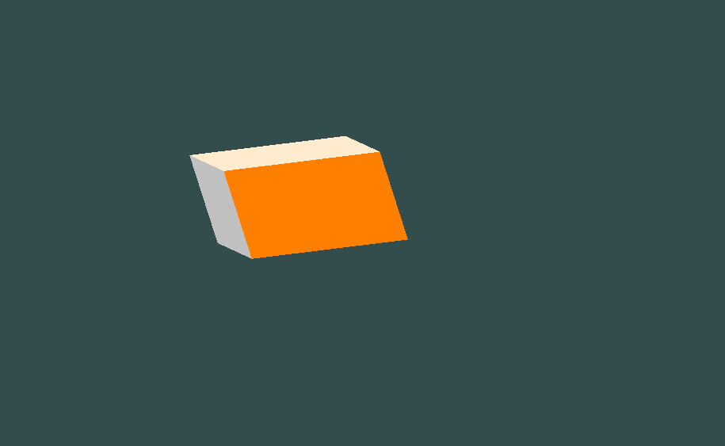
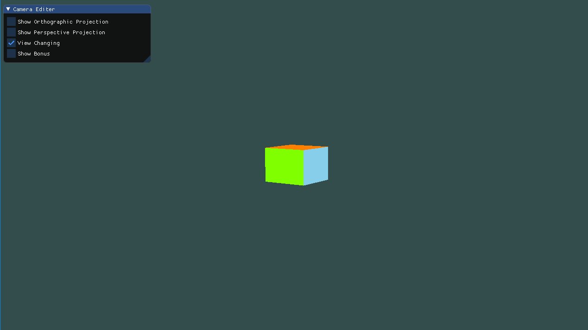

# 计算机图形学 - Homework 5

### 姓名：陈明亮

### 学号：16340023


> Basic 部分

## 一、将上次作业绘制的`Cube`放置在`(-1.5, 0.5, -1.5)`位置，同时要求6个面颜色不一致
* 首先结合上次作业绘制的正方体`model`，改变初始放置位置只需要调用`glm::translate()`函数：

  ```c++
  model = glm::translate(model, glm::vec3(-1.5, 0.5, -1.5));
  ```

  ​

* 接下来的任务就是分别为正方体的六个面绘制不同颜色，在分配颜色数组之前，我们需要修改顶点着色器`vertexShader`和片段着色器`fragmentShader`的代码：

  ```c++
  // Vertex Shader

  #version 330 core

  // Input vertex data, different for all executions of this shader.
  layout (location = 0) in vec3 Position;
  layout (location = 1) in vec3 inColor;

  uniform mat4 model;
  uniform mat4 view;
  uniform mat4 projection;

  // Output one color to fragment shader
  out vec3 outColor;

  void main(){
      gl_Position = projection * view * model * vec4(Position, 1.0);
      outColor = inColor;
  }

  ```

  顶点着色器的编写大致与上次作业的相同，也是利用MVP模型，为立方体的绘制增加矩阵运算与正常显示，至于每个面颜色的分配，顶点着色器只需要将输入的三维颜色输出即可。

  ```c++
  // Fragment Shader

  #version 330 core

  // Ouput data
  out vec3 oColor;

  // Input data
  in vec3 outColor;

  void main(){
  	oColor = vec3(outColor/255.0f);
  }
  ```

  片段着色器中，我们此处定义输入的颜色数组往往是`0-255`的`RGB`颜色数值，所以片段着色器必须将输入的整型颜色，经过除法运算得出小数表示，正确地显示目标颜色。

  ​

* 然后就可以通过搜寻自己心仪的颜色`RGB`值，利用顶点缓冲对象进行颜色数组的绑定与启用，进行立方体颜色的绘制：

  1. 定义颜色数组

     ```c++
     GLfloat colors[] = {
         192, 192, 192,
         192, 192, 192,
         192, 192, 192,
         192, 192, 192,
         192, 192, 192,
         192, 192, 192,

         135, 206, 235,
         135, 206, 235,
         135, 206, 235,
         135, 206, 235,
         135, 206, 235,
         135, 206, 235,

         127, 255, 0,
         127, 255, 0,
         127, 255, 0,
         127, 255, 0,
         127, 255, 0,
         127, 255, 0,

         255, 235, 205,
         255, 235, 205,
         255, 235, 205,
         255, 235, 205,
         255, 235, 205,
         255, 235, 205,

         218, 112, 214,
         218, 112, 214,
         218, 112, 214,
         218, 112, 214,
         218, 112, 214,
         218, 112, 214,

         255, 128, 0,
         255, 128, 0,
         255, 128, 0,
         255, 128, 0,
         255, 128, 0,
         255, 128, 0
     };
     ```

     ​

  2. 绑定顶点缓冲对象，启用顶点颜色渲染数组

     ```c++
     GLuint VCO;
     glGenBuffers(1, &VCO);
     glBindBuffer(GL_ARRAY_BUFFER, VCO);
     glBufferData(GL_ARRAY_BUFFER, sizeof(colors), colors, GL_STATIC_DRAW);

     // Color Attributes binding
     glEnableVertexAttribArray(1);
     glBindBuffer(GL_ARRAY_BUFFER, VCO);
     glVertexAttribPointer(1, 3, GL_FLOAT, GL_FALSE, 0, (void*)0);
     ```

     ​

* 结果展示：

  


## 二、实现正交投影，使用多组参数，比较结果差异

### 1. 什么是正交投影？

* 正射投影矩阵定义了一个类似`立方体`的平截头箱，它定义了一个裁剪空间，在这空间之外的顶点都会被裁剪掉，正交投影的示意图如下：

  

  

* 正交投影函数通过定义各个参数的数值，实际上确定了平行可视长方体空间，摄像头的位置以平行水平方向查看该长方体，靠近视点的一侧面成为近平面`near`，左右侧面分别是`left, right`，上下侧面分别是`top, bottom`，远平面`far`，构成整个正交投影的视图。

  ​

* 在`glm`函数库中，`glm::ortho()`函数即为正交投影的函数原型，接收的六个参数, 分别是：`left`, `right`, `bottom`,`top`,`near`,`far`。前两个参数分别表示x轴最小坐标和最大坐标，中间两个参数负责y轴，最后两个是z轴值

  正交投影创建一个平行视景体（就是一个长方体空间区域），实际上这个函数的操作是创建一个正射投影矩阵，并且用这个矩阵乘以当前矩阵。
  其中近裁剪平面是一个矩形，矩形左下角点三维空间坐标是`（left，bottom，-near）`，右上角点是`（right，top，-near）`；远裁剪平面也是一个矩形，左下角点空间坐标是`（left，bottom，-far）`，右上角点是`（right，top，-far）`。


### 2. 结合参数控制，实现正交投影

* 在`glm`库中，我们可以直接使用库函数`ortho`进行正交投影的实现，通过将投影矩阵进行正交投影操作，同时设置参数为可以手动修改的情况，我们就可以实现结合参数控制的正交投影：

  ```c++
  if (ortho) {
      model = glm::rotate(model, 15.0f, glm::vec3(1.0f, 1.0f, 1.0f));

      view = glm::translate(view, glm::vec3(3.0f, 3.5f, -7.0f));
      projection = glm::ortho(left, right, bottom, top, near, far);
  }
  ```

  ​

* 此处为了使视图更加明显，为初始模型加上旋转操作，保证观察正方体时效果更好。使用了斜上方视角观看正方体模型，对接下来的参数变化，引起的正交投影变化，有更明显的判断，下图为投影之前的原始图。

  


### 3. 采用控制变量法，比较对不同参数对正交投影的作用

* `Left`参数

  减小`Left`参数数值，可以发现投影的左平面往左侧移动，整体的正方体视图也向左移动，符合了正交投影的概念。

  

  ​

* `Right`参数

  增大`Right`参数值，投影空间的右平面往右侧移动，导致视图内部的正方体向右伸展。

  

  ​

* `Bottom`参数

  减小`Bottom`参数值，投影空间的底部平面向下变换，正交投影视图向下运动。

  

  ​

* `Top`参数

  增大`Top`参数值，投影空间的上平面向上变换，导致正方体视图向上拉伸。

  

  ​

* `Near`参数

  增大`Near`参数值，导致近平面逐渐向模型的另一侧进行移动，此处的展示图显示了当`Near`参数值超过一定限制时，会导致投影时，正方体靠近视点的一面不显示，原因就是因为投影空间的近平面运动至正方体内部，导致视图上显示了正方体的另一侧的各个面。

  

  ​

* `Far`参数

  减小`Far`参数值，直接导致投影空间内的远平面向前运动，下图展示了当`Far`参数小于一定限制时，会导致正方体的部分不在投影空间内，甚至靠近视点的正方体面也不在投影空间内，这样就会导致视图中的正方体是不完整的。

  


## 三、实现透视投影，使用多组参数，比较结果差异

### 1. 什么是透视投影？

* 透视投影是为了获得接近真实三维物体的视觉效果，而在二维的纸或者画布平面上绘图或者渲染的一种方法，也称为透视图。它具有消失感、距离感、相同大小的形体呈现出有规律的变化等一系列的透视特性，能逼真地反映形体的空间形象。透视投影通常用于动画、视觉仿真以及其它许多具有真实性反映的方面。

  由于透视，两条平行线在很远的地方看起来会相交。这正是透视投影想要模仿的效果，它是使用透视投影矩阵来完成的，与正交投影不同，透视投影创建的投影空间如下图所示：

  ​

  

  

  * 在透视投影中，参数`fovy`定义视野在`Y-Z`平面的角度，范围是`[0.0, 180.0]，`参数`aspect`是投影平面宽度与高度的比率，参数`Near`和`Far`分别是近远裁剪面到视点(沿Z负轴)的距离，实际上就代表着投影空间中的近平面和远平面。

    ​

  * 透视投影矩阵与正交投影矩阵不同的一点是修改了每个顶点坐标的`w`值，使得离观察者越远的顶点坐标`w`分量越大。被变换到裁剪空间的坐标都会在`-w`到`w`的范围之间，所有不符合范围的坐标点都会被舍弃。`OpenGL`要求所有可见的坐标都落在-1.0到1.0范围内，作为`Vertex Shader`最后的输出，因此，一旦坐标在裁剪空间内之后，透视除法就会被应用到裁剪空间坐标上。

    ​


### 2.结合参数控制，实现透视投影 

* 结合`glm`库函数`perspective()`，我们可以通过设定上述参数为可控制参数，在`ImGui`中进行手动控制，并将其参数值绑定到函数形参中，达到参数控制的透视投影实现：

  ```c++
  if (perspective) {
  	projection = glm::perspective(glm::radians(radius), aspect, zNear, zFar);
  }
  ```

  ​

* 初始情况下，透视投影的效果图：

  


### 3. 检测参数变化对透视投影的作用

* `Fovy`参数

  增大`Fovy`参数值，导致透视投影中，视点对`Y-Z`平面的观察角变大，实际上正方体的投影结果会对应变小：

  

  减小`Fovy`参数值，导致透视投影中，视点观察角变小，能够看到的区域变窄，导致投影结果中的正方体视图变大：

  

  ​

* `Aspect`参数

  增大`Aspect`参数值，导致视点观察到的面宽高比变大，正方体透视投影面变成扁平状，如下图：

  

  减小`Aspect`参数值，导致可视面的宽高比变小，正方体的透视结果变成窄高状，如下图：

  

  ​

* `Near`参数

  实际上，透视投影的`Near`参数作用于正交投影中的类似，当`Near`参数值超过一定限制时，视点能够观察到的近平面已经变换到正方体的内部，导致投影结果中观察到的是正方体的另一侧各个面：

  

  ​

* `Far参数`

  同理，当`Far`参数小于一定限制时，远平面过于靠近视点，导致投影结果中的正方体是不完全的：

  


## 四、实现视角变换，使得摄像机绕着正方体为中心转动

* 实现摄像机围绕着正方体为中心转动，实际上只需要根据圆周运动的极坐标系方程即可：
  $$
  X = sin(\theta) * R \\
  Z = cos(\theta) * R
  $$
  主要代码如下：

  ```c++
  if (view_change) {
      float radius = 10.0f;
      float camX = sin(glfwGetTime())*radius;
      float camZ = cos(glfwGetTime())*radius;


      view = glm::lookAt(glm::vec3(camX, 2.0f, camZ), glm::vec3(-1.5, 0.5, -1.5),
      						glm::vec3(0.0f, 1.0f, 0.0f));
  }
  ```

  根据`glfwGetTime()`，实现随时间变换的角度值，从而引起摄像机的位置变换，之后的`view`即是摄像机的定义矩阵，`lookAt()`函数接收摄像机的位置向量，方向向量和上向量的输入，从而定位一个摄像机的所有参数。

  

  ​

* 结果展示：

  


## 五、完善`ImGui`菜单选项

* 功能选项：

  

* 正交投影参数调整选项：

  

* 透视投影参数调整选项：

  


## 六、对于`OpenGL`中将摄像机空间与物体空间合二为一的思考

1. `OpenGL`采用的是相机模型，就是把视图变换操作类比为使用照相机拍摄照片的过程，具体步骤如下：

   1. 将准备拍摄的对象移动到场景中指定位置。`模型变换，Model Transform`
   2. 将相机移动到准备拍摄的位置，将它对准某个方向。`视图变换，View Transform`
   3. 设置相机的焦距，或者调整缩放比例。`投影变换，Projection Transform`
   4. 拍摄照片并变换到需要的图片大小

   将`View`乘以`Model`得到的矩阵，在`OpenGL`固定管线中称为模型视图矩阵`ModelView - Matrix`，可以通过`glMatrixMode(GL_MODELVIEW)`进行设置。


2. 那么模型视图矩阵相对于分开的模型矩阵，视图矩阵的区别何在？又有什么好处呢？

   * 实际上，观察者的移动与摄像机的移动存在着逆关系，如果将观察者视为一个模型，那么视图矩阵就是观察者的模型矩阵的逆矩阵。

     ​

   * 观察者平移了`(tx, ty, tz)`，相当于整个世界平移了`(-tx, -ty, -tz)`，

     观察者绕`Z`轴旋转了角度`θ`，相当于整个世界绕Z轴旋转了`-θ`度，

     观察者在三个方向等比例缩小了`s`倍，相当于整个世界等比例放大了`s`倍。

     此处的世界往往代表着用户的视图，也就是摄像机的视图矩阵变换。

     ​

   * 相比点的世界坐标，我们更关心点相对于观察者的位置（视图坐标）。如果观察者置于原点处，面向Z轴负半轴，那么点的世界坐标就是其试图坐标。观察者的位置和方向会变化，看上去就好像整个世界的位置和方向发生变化了一样，所以我们将世界里的所有模型看作一个大模型，在所有模型矩阵的左侧再乘以一个表示整个世界变换的模型矩阵，就可以了。

     ​

   * 好处在于`ModelView`矩阵相比于把`Model`跟`View`分开，在矩阵存储上较为轻便，同时更利用了模型矩阵和视图矩阵之间的关系，强调了`OpenGL`中的模型视图原理。

     ​

> Bonus部分

## 七、实现`Camera`类，通过键盘移动和鼠标移动，控制摄像机位置

* 实现视角的键盘控制，也就是上下左右移动，实际上只需要简单地通过控制摄像头的位置向量即可，此处首先需要做的就是定义`W,A,S,D`的枚举对象：

  ```c++
  enum WSAD_Movement {
  	W,S,A,D
  };
  ```

  进而需要在主渲染循环中进行键盘输入的监听，监听函数定义为：

  ```c++
  void processInput(GLFWwindow *window) 
  {
  	if (glfwGetKey(window, GLFW_KEY_ESCAPE) == GLFW_PRESS)
  		glfwSetWindowShouldClose(window, true);
  	// WSAD Moving
  	if (glfwGetKey(window, GLFW_KEY_W) == GLFW_PRESS)
  		camera.ProcessKeyboard(W, deltaTime);
  	if (glfwGetKey(window, GLFW_KEY_S) == GLFW_PRESS)
  		camera.ProcessKeyboard(S, deltaTime);
  	if (glfwGetKey(window, GLFW_KEY_A) == GLFW_PRESS)
  		camera.ProcessKeyboard(A, deltaTime);
  	if (glfwGetKey(window, GLFW_KEY_D) == GLFW_PRESS)
  		camera.ProcessKeyboard(D, deltaTime);
  }
  ```

  监听键盘输入的函数，通过调用`Camera`类内部函数，进行移动的信息传递，`ProcessKeyboard`函数通过检测传入参数，进行摄像机的位置向量变换，从而达到移动的效果：

  ```c++
  // Process keyboard input, moving with W S A D
  void ProcessKeyboard(WSAD_Movement direction, float deltaTime)
  {
      float velocity = MovementSpeed * deltaTime;
      if (direction == W)
          moveForward(velocity);
      if (direction == S)
          moveBack(velocity);
      if (direction == A)
          moveLeft(velocity);
      if (direction == D)
          moveRight(velocity);
  }
  ```

  ```c++
  void moveForward(const float distance){
  	Position += Front * distance;
  }

  void moveBack(const float distance){
  	Position -= Front * distance;
  }

  void moveRight(const float distance){
  	Position += Right * distance;
  }

  void moveLeft(const float distance){
  	Position -= Right * distance;
  }
  ```


* 当然，只完成通过键盘移动是不够的，我们还需要鼠标操作来控制摄像机视角和位置的变换，首先需要了解欧拉角的定义：

  1. 欧拉角`Euler Angle`是可以表示3D空间中任何旋转的3个值，由莱昂哈德·欧拉`Leonhard Euler`在18世纪提出。一共有3种欧拉角：俯仰角`Pitch`、偏航角`Yaw`和滚转角`Roll`，下面的图片展示了它们的含义：

     

  2. 俯仰角是描述我们如何往上或往下看的角，可以在第一张图中看到。第二张图展示了偏航角，偏航角表示我们往左和往右看的程度。滚转角代表我们如何**翻滚**摄像机，通常在太空飞船的摄像机中使用。每个欧拉角都有一个值来表示，把三个角结合起来我们就能够计算3D空间中任何的旋转向量了。

     ​


* 定义`Camera`类结构，然后分别进行类内部成员函数的实现：

  ```c++
  class Camera 
  {
  public:
  	// Camera Attributes
  	glm::vec3 Position;
  	glm::vec3 Front;
  	glm::vec3 Up;
  	glm::vec3 Right;
  	glm::vec3 WorldUp;
  	// Euler Angles
  	float Yaw, Pitch;
  	// Camera options
  	float MovementSpeed, MouseSensitivity, Zoom;

  	// Constructor with origin location vectors
  	Camera(glm::vec3 position = glm::vec3(0.0f, 0.0f, 0.0f),
             glm::vec3 up = glm::vec3(0.0f, 1.0f, 0.0f), 
             float yaw = YAW, float pitch = PITCH);

  	// Returns the view matrix calculated using Euler Angles and the LookAt Matrix
  	glm::mat4 GetViewMatrix();

  	void moveForward(const float distance);

  	void moveBack(const float distance);

  	void moveRight(const float distance);

  	void moveLeft(const float distance);

  	// Process keyboard input, moving with W S A D
  	void ProcessKeyboard(WSAD_Movement direction, float deltaTime);

  	// Process mouse input, moving with mouse
  	void ProcessMouseMovement(float xoffset, float yoffset, GLboolean constrainPitch = true);

  	// Process with mouse scroll
  	void ProcessMouseScroll(float yoffset);

  private:
  	// Calculates the front vector from the Camera's (updated) Euler Angles
  	void updateCameraVectors();
  };
  ```

  ​

* 结合欧拉角的定义，我们需要现在主程序中监听鼠标的移动，和滚轮的移动，具体的做法是通过设置回调函数，在回调过程中将鼠标的移动信息传输给`Camera`类的成员函数，进而影响摄像机的位置和视角：

  ```c++
  void mouse_callback(GLFWwindow* window, double xpos, double ypos)
  {
  	if (firstMouse)
  	{
  		lastX = xpos;
  		lastY = ypos;
  		firstMouse = false;
  	}

  	float xoffset = xpos - lastX;
  	float yoffset = lastY - ypos;

  	lastX = xpos;
  	lastY = ypos;

  	camera.ProcessMouseMovement(xoffset, yoffset);
  }

  void scroll_callback(GLFWwindow* window, double xoffset, double yoffset)
  {
  	camera.ProcessMouseScroll(yoffset);
  }
  ```

  上述回调函数中，`mouse_callback`将鼠标的移动偏移量传输给`camera`的鼠标移动处理函数`ProcessMouseMoveMent`，`scroll_callback`将鼠标滚轮的`y`方向偏移量传输给`camera`的滚轮移动处理函数。

  绑定回调函数：

  ```c++
  glfwSetCursorPosCallback(window, mouse_callback);
  glfwSetScrollCallback(window, scroll_callback);
  ```

  ​

* 在`Camera`类内部进行对鼠标位置移动的处理，将鼠标偏移量与设定的灵敏度进行乘积，获取坐标的实偏移量，分别添加到`Yaw`和`Pitch`方向角上，此处仍需要对范围进行控制，防止偏航角超过90度。

  ```c++
  // Process mouse input, moving with mouse
  void ProcessMouseMovement(float xoffset, float yoffset, GLboolean constrainPitch = true)
  {
      xoffset *= MouseSensitivity;
      yoffset *= MouseSensitivity;

      Yaw += xoffset;
      Pitch += yoffset;

      // Make sure that when pitch is out of bounds, screen doesn't get flipped
      if (constrainPitch)
      {
      if (Pitch > 89.0f)
      	Pitch = 89.0f;
      if (Pitch < -89.0f)
      	Pitch = -89.0f;
      }

      // Update Front, Right and Up Vectors using the updated Euler angles
      updateCameraVectors();
  }
  ```

  对滚轮的处理，只需要修改摄像机的`Zoom`参数即可，对应于摄像机对于当前视图的深度参数：

  ```c++
  // Process with mouse scroll
  void ProcessMouseScroll(float yoffset)
  {
      if (Zoom >= 1.0f && Zoom <= 45.0f)
      	Zoom -= yoffset;
      if (Zoom <= 1.0f)
      	Zoom = 1.0f;
      if (Zoom >= 45.0f)
      	Zoom = 45.0f;
  }
  ```

  ​

* 自由移动的结果展示：

  