# 计算机图形学 - Homework 6

### 姓名：陈明亮

### 学号：16340023


> Basic 部分

## 一、 在场景中绘制Cube物体模型和Light光源模型
* 结合前面几次作业绘制正方体的过程，我们首先定义物体正方体顶点数组，绑定顶点缓冲数组，定义相应的物体颜色，绘制物体正方体。


  ```c++
  // OpenGL Drawing Vertex array
  GLfloat vertices[] = {
      -0.5f, -0.5f, -0.5f,
      0.5f, -0.5f, -0.5f,
      0.5f,  0.5f, -0.5f,
      0.5f,  0.5f, -0.5f,
      -0.5f,  0.5f, -0.5f,
      -0.5f, -0.5f, -0.5f,

      -0.5f, -0.5f,  0.5f,
      0.5f, -0.5f,  0.5f,
      0.5f,  0.5f,  0.5f,
      0.5f,  0.5f,  0.5f,
      -0.5f,  0.5f,  0.5f,
      -0.5f, -0.5f,  0.5f,

      -0.5f,  0.5f,  0.5f,
      -0.5f,  0.5f, -0.5f,
      -0.5f, -0.5f, -0.5f,
      -0.5f, -0.5f, -0.5f,
      -0.5f, -0.5f,  0.5f,
      -0.5f,  0.5f,  0.5f,

      0.5f,  0.5f,  0.5f,
      0.5f,  0.5f, -0.5f,
      0.5f, -0.5f, -0.5f,
      0.5f, -0.5f, -0.5f,
      0.5f, -0.5f,  0.5f,
      0.5f,  0.5f,  0.5f,

      -0.5f, -0.5f, -0.5f,
      0.5f, -0.5f, -0.5f,
      0.5f, -0.5f,  0.5f,
      0.5f, -0.5f,  0.5f,
      -0.5f, -0.5f,  0.5f,
      -0.5f, -0.5f, -0.5f,

      -0.5f,  0.5f, -0.5f,
      0.5f,  0.5f, -0.5f,
      0.5f,  0.5f,  0.5f,
      0.5f,  0.5f,  0.5f,
      -0.5f,  0.5f,  0.5f,
      -0.5f,  0.5f, -0.5f
  };
  ```

  建立物体模型缓冲数组对象，同时建立`VBO`存储顶点数组数据，初步绘制物体模型：

  ```c++
  // Vertex Array Object Define
  GLuint object_VAO;
  glGenVertexArrays(1, &object_VAO);
  glBindVertexArray(object_VAO);

  GLuint VBO;
  glGenBuffers(1, &VBO);
  glBindBuffer(GL_ARRAY_BUFFER, VBO);
  glBufferData(GL_ARRAY_BUFFER, sizeof(vertices), vertices, GL_STATIC_DRAW);

  // position attribute
  glVertexAttribPointer(0, 3, GL_FLOAT, GL_FALSE, 6 * sizeof(float), (void*)0);
  glEnableVertexAttribArray(0);
  ```

  ​

* 对于光源模型，此处为了使得程序代码不重复化，采用与物体模型相同的顶点数组，结合`glm`函数库的`translate`和`scale`函数将光源模型位置移动，同时缩放到合适的大小。

  ```c++
  GLuint sun_VAO;
  glGenVertexArrays(1, &sun_VAO);
  glBindVertexArray(sun_VAO);

  glBindBuffer(GL_ARRAY_BUFFER, VBO);

  glVertexAttribPointer(0, 3, GL_FLOAT, GL_FALSE, 6 * sizeof(float), (void*)0);
  glEnableVertexAttribArray(0);
  ```

  ```c++
  model = glm::scale(model, glm::vec3(0.2f));
  model = glm::translate(model, lightPos);
  ```

  ​

* 此处我们将绘制物体模型和绘制光源模型的顶点着色器程序和片段着色器程序分开，对于光源模型的着色器程序，采用前面作业的成果就行，对于物体模型的着色器程序，为了初步实现全局光照的效果，需要在片段着色器针对输入的光源颜色和物体颜色进行着色输出操作，输出颜色即为光照颜色与物体颜色的简单乘积。

  ```c++
  #version 330 core
  out vec4 FragColor;

  uniform vec3 lightColor;
  uniform vec3 objectColor;

  void main()
  {
  	FragColor = vec4(lightingColor * objectColor, 1.0);
  }
  ```

  此处在主程序中定义的光照颜色和物体颜色分别为：(白色光照，青绿色物体)

  ```c++
  // Define Cube Color and Light Color
  glm::vec3 objectColor = glm::vec3(0.5f, 0.7f, 0.2f);
  glm::vec3 lightColor = glm::vec3(1.0f, 1.0f, 1.0f);
  ```

  ​

* 通过初步完成模型绘制和光照效果，场景结果如下：

  


## 二、 通过编写Shader，实现Phong Shading，并解释其实现原理

* 可以看到，初步编写片段着色器实现环境全局光照的效果，实际上与现实生活中的光照效果完全不同，正方体的每个面不应该是均匀分配光照的，而应该是与光源的位置，物体本身的材质决定每个面的光照效果，所以我们需要结合`Phong Shading`的模型思想，整改着色器程序。

  ​

* `Phong Shading Model`由3个分量组成：环境`Ambient`、漫反射`Diffuse`和镜面`Specular`光照，下图分别展示了此三个分量特征效果：

  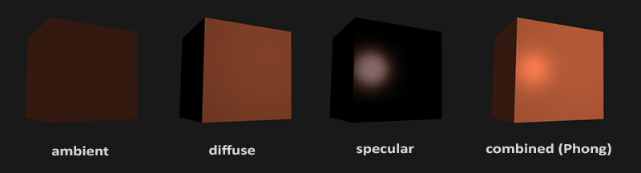

  1. 环境光照`Ambient Lighting`：即使在黑暗的情况下，世界上通常也仍然有一些光亮（月亮、远处的光），所以物体几乎永远不会是完全黑暗的。为了模拟这个，我们会使用一个环境光照常量，它永远会给物体一些颜色。
  2. 漫反射光照`Diffuse Lighting`：模拟光源对物体的方向性影响(Directional Impact)。它是冯氏光照模型中视觉上最显著的分量。物体的某一部分越是正对着光源，它就会越亮。
  3. 镜面光照`Specular Lighting`：模拟有光泽物体上面出现的亮点。镜面光照的颜色相比于物体的颜色会更倾向于光的颜色。

  此三种分量组合成最终`Phong Shading`的光照总量，由以下算式得出：

  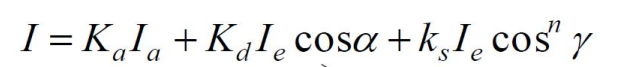

  其中，`K`分别代表不同材质对不同光照分量的影响因素，`I`代表不同光照分量的强度。

  ​


* 首先，对于环境光照分量的计算，处理过程十分简单，只需要将定义的环境影响因子`ambientStrength`与输入的光照颜色，物体颜色相乘，最终结果就是结合了环境影响的效果颜色：

  ```c++
  void main()
  {
      float ambientStrength = 0.1;
      vec3 ambient = ambientStrength * lightColor;

      vec3 result = ambient * objectColor;
      FragColor = vec4(result, 1.0);
  }
  ```

  ​

* 漫反射的结果与物体表面的材质是密切相关的，漫反射光照使物体上与光线方向越接近的片段能从光源处获得更多的亮度。 我们需要计算的是漫反射后得到的反射光的强度，计算的原理很简单，根据入射光的角度以及对应的法向量就可以计算出结果，漫反射光照的原理示意图如下：

  


  为了能够合理的获得漫反射光照分量的计算结果，我们需要针对正方体每个面进行法向量的设定，具体的设定过程，将不同面对应的不同法向量坐标放置到顶点数组中，输入到顶点着色器中。

  实际上，由于顶点着色器对应于物体坐标系，片段着色器对应于世界坐标系，所以在顶点着色器的处理中，我们需要引入法线矩阵来调整输出的法向量，再将结果返回给片段着色器，防止数据错误：

  ```c++
   Normal = mat3(transpose(inverse(model))) * aNormal
  ```

  

* 片段着色器的主要工作，首先结合输入法向量，进行入射光线的角度获取，以及入射角度`cos(a)`的计算，最终结合定义的材质因子`diffuseStrength`输出漫反射光照的分量大小输出：

  ```c++
  // diffuse 
  vec3 norm = normalize(Normal);
  vec3 lightDir = normalize(lightPos - Position);
  float diff = max(dot(norm, lightDir), 0.0);
  vec3 diffuse = diffuseStrength * diff * lightColor;
  ```

  ​

* 镜面反射不仅依赖于入射光和法向量，也依赖于观察者所处的位置，以及材质的发光常数。这里就需要我们对于观察者和物体、光线之间的相对位置进行处理。

  

  片段着色器通过反射法向量周围光的方向来计算反射向量。然后我们计算反射向量和视线方向的角度差，如果夹角越小，那么镜面光的影响就会越大。它的作用效果就是，当我们去看光被物体所反射的那个方向的时候，我们会看到一个高光。

  观察向量是镜面光照附加的一个变量，我们可以使用观察者世界空间位置和片段的位置来计算它。

  通过计算视线的方向向量，以及入射光线对应的出射光线向量，最终结合镜面反射影响因子`specularStrength`，计算镜面分量，其中`reflectStrength`对应反光度，反光度越高得到的散射光越少，高光点就会越小

  ```c++
  // specular
  vec3 viewDir = normalize(viewPos - Position);
  vec3 reflectDir = reflect(-lightDir, norm);  
  float spec = pow(max(dot(viewDir, reflectDir), 0.0), reflectStrength);
  vec3 specular = specularStrength * spec * lightColor; 
  ```

  ​

* 最终实现的`Phong Shading`模型结果，与相关参数设置情况：

  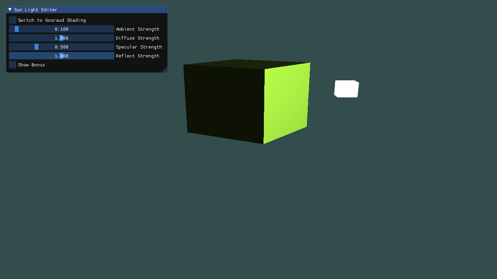


## 三、 实现Gouraud Shading，解释其实现原理

* 如果将`Phonging Lighting Model`的核心处理过程，放置在顶点着色器程序进行光照分量的计算，这种处理模型就被称为`Gouraud Shading`。

  相比在片段着色器中处理，需要考虑的顶点要少得多，因此会更高效，整体计算时间更短。然而，顶点着色器中的最终颜色值是仅仅只是那个顶点的颜色值，片段的颜色值是由插值光照颜色所得来的。结果就是这种光照看起来不会非常真实，除非使用了大量顶点。

  ​


* `Gouraud Shading`模型往往在顶点着色器中，对于正方体关键顶点的颜色值，结合`Phonging Shading`光照向量的计算模型`环境分量 + 漫反射分量 + 镜面反射分量`，运算出顶点的颜色值，从而在多边形光栅化的过程中，对其余顶点的颜色值进行线性插值操作。这样的处理过程只需要对正方体的全体顶点子集进行光照模型的结果颜色进行计算，其余顶点通过插值获取颜色，节省了大量的计算时间，但结果较为粗略，不自然。

  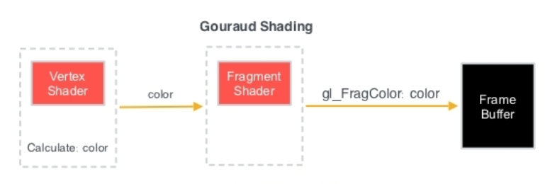


* `Gouraud Shading`顶点着色器执行过程为：

  1. 通过`MVP`结构计算出顶点的`gl_Position`
  2. 结合`Phong Shading`模型的环境分量、漫反射分量和镜面反射分量进行顶点光照效果颜色的计算，主要的原理与上文提及的分量计算过程完全一致
  3. 输出顶点颜色计算结果，传给片段着色器进行渲染

  ```c++
  #version 330 core
  layout (location = 0) in vec3 aPos;
  layout (location = 1) in vec3 aNormal;

  out vec3 lightingColor;

  uniform mat4 model;
  uniform mat4 view;
  uniform mat4 projection;

  uniform vec3 lightPos; 
  uniform vec3 viewPos; 
  uniform vec3 lightColor;

  uniform float ambientStrength;
  uniform float diffuseStrength;
  uniform float specularStrength;
  uniform float reflectStrength;

  void main()
  {
      gl_Position = projection * view * model * vec4(aPos, 1.0);

      vec3 Position = vec3(model * vec4(aPos, 1.0));
      vec3 Normal = mat3(transpose(inverse(model))) * aNormal;

      // ambient
      vec3 ambient = ambientStrength * lightColor;

      // diffuse 
      vec3 norm = normalize(Normal);
      vec3 lightDir = normalize(lightPos - Position);
      float diff = max(dot(norm, lightDir), 0.0);
      vec3 diffuse = diffuseStrength * diff * lightColor;

      // specular
      vec3 viewDir = normalize(viewPos - Position);
      vec3 reflectDir = reflectStrength * reflect(-lightDir, norm);  
      float spec = pow(max(dot(viewDir, reflectDir), 0.0), 32);
      vec3 specular = specularStrength * spec * lightColor;      

      lightingColor = ambient + diffuse + specular;
  }
  ```

  ​

* `Gouraud Shading`片段着色器执行过程为：获取到顶点着色器的计算结果，经过简单的乘法操作与环境光颜色进行乘积运算，依赖于光栅化过程，将对应片段的顶点进行线性插值计算，最终输出其差值后的颜色：

  ```c++
  #version 330 core
  out vec4 FragColor;

  in vec3 lightingColor;

  uniform vec3 objectColor;

  void main()
  {
  	FragColor = vec4(lightingColor * objectColor, 1.0);
  } 
  ```

  ​

* 最终实现的`Gouraud Shading`模型显示结果，以及相关参数设置：

  


## 四、 合理调整视点和光照位置，比较两种Shading的光照效果不同点

* 针对于视点的调整，此处自定义对应的视点和光源位置，使得光照效果直观化：

  ```c++
  glm::vec3 lightPos(5.0f, 1.0f, 2.0f);
  glm::vec3 viewPos(0.0f, 1.0f, 5.0f);
  ```

  ​

* `Phong Shading`和`Gouraud Shading`模型的光照效果的不同点有：

  1. `Gouraud Shading`形成的光照效果较为逊色，依赖于光栅化过程，同时当反光度提升时，其效果较为糟糕，形成的光源点反射较为分散。

  2. `Phong Shading`的渲染过程较为耗时，计算效率没有后者高。

     ​

* 控制参数不变，提高`specular`因子和反光率，`Gouraud Shading`光照效果较差，反光区域分散：

  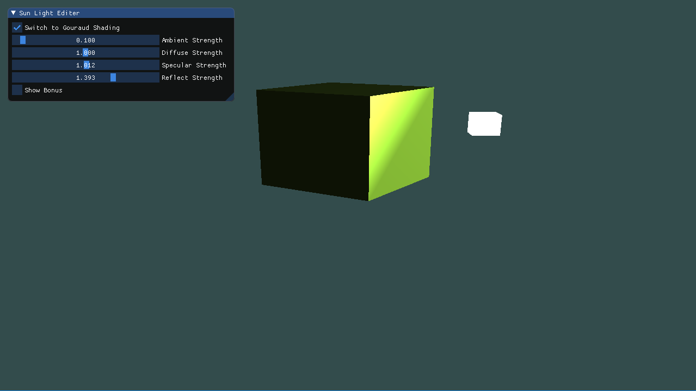

  `Phong Shading`模型结果十分自然：

  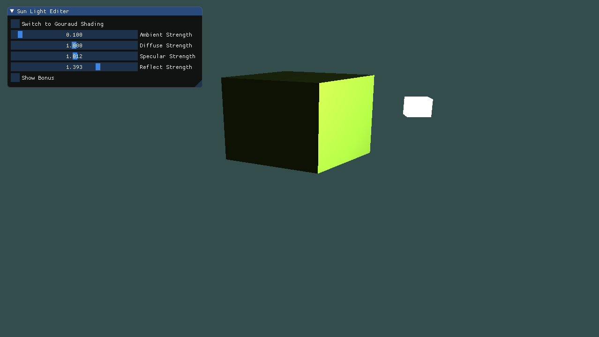


* 再提升反光率系数，发现`Gouraud Shading`模型出现光栅化插值的缺点 -- 三角形区域出现过曝现象：

  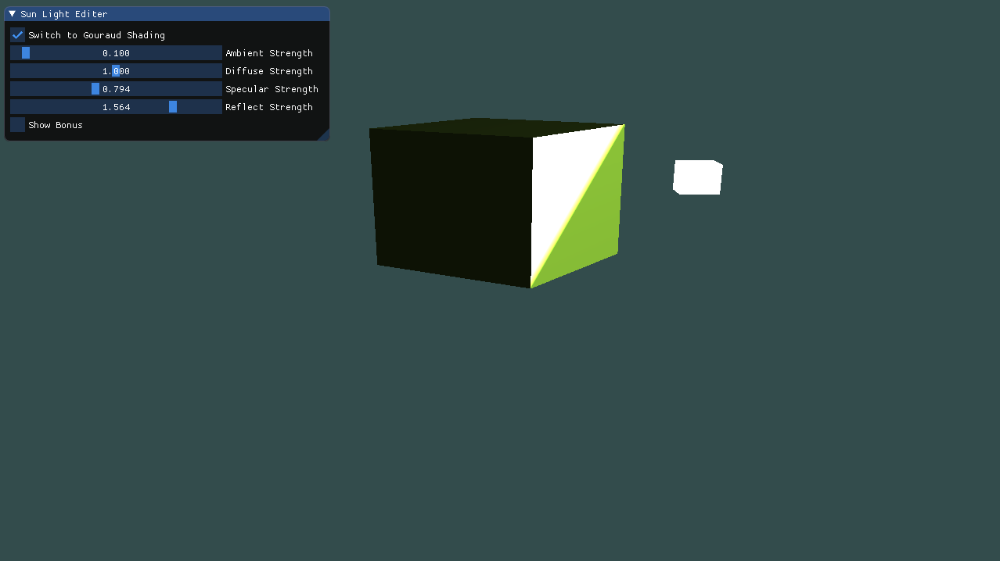

  然而`Phong Shading`依旧呈现十分舒服的光照结果：

  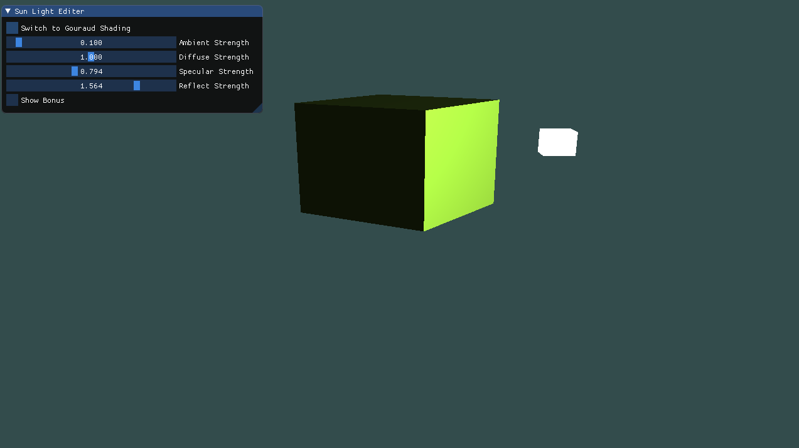


## 五、 增加ImGUI控件，改变ambient因子、diffuse因子、specular因子、reflect因子，实时更改光照效果

* 在主程序增加`ImGui`各项控件，允许`Phong Shading`和`Gouraud Shading`模式之间的相互切换：

  ```c++
  ImGui::Checkbox("Switch to Gouraud Shading", &mode);
  ```

  添加各个因子的调节滑动条：

  ```c++
  ImGui::SliderFloat("Ambient Strength", &ambientStrength, 0.0f, 2.0f);
  ImGui::SliderFloat("Diffuse Strength", &diffuseStrength, 0.0f, 2.0f);
  ImGui::SliderFloat("Specular Strength", &specularStrength, 0.0f, 2.0f);
  ImGui::SliderFloat("Reflect Strength", &reflectStrength, 0.0f, 2.0f);
  ```

  增加`Bonus`选项：

  ```c++
  ImGui::Checkbox("Show Bonus", &showBonus);
  ```

  ​

* 实现效果：

  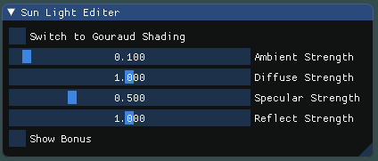

  ​

* 检测各项影响因子对光照效果的影响，此处的光照模型采取的是`Phong Shading`:

  1. 环境影响因子`ambient Strength`

     * 降低

       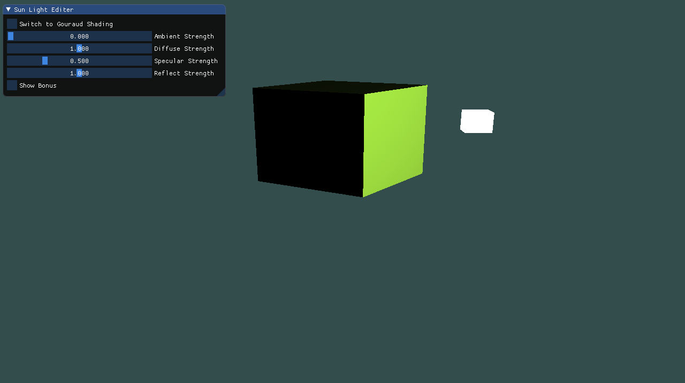

     * 升高(由于环境影响因子的提升，导致其余面收到的光照效果增强)

       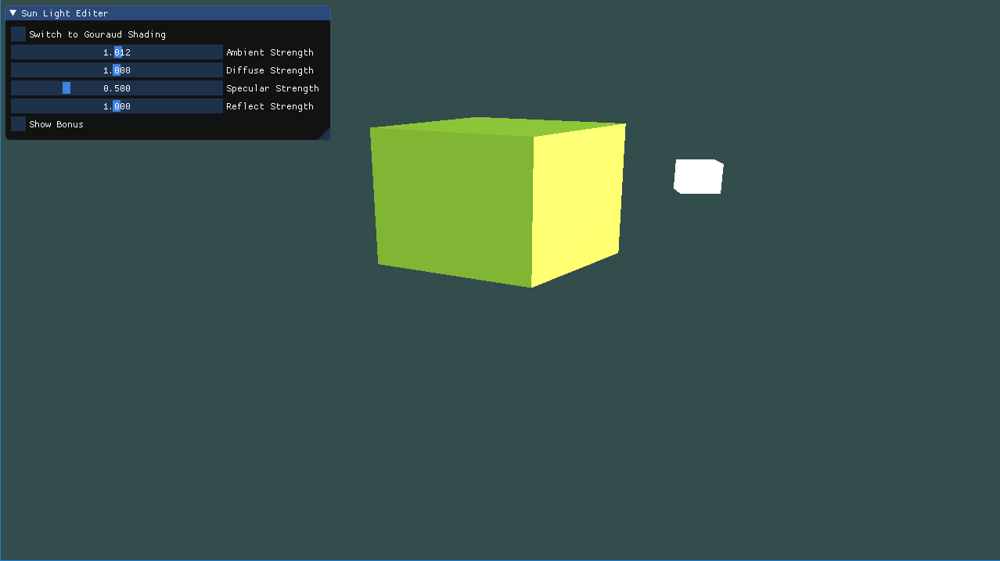

  2. 材质系数`diffuse Strength`

     * 降低(材质系数降低，漫反射分量减小)

       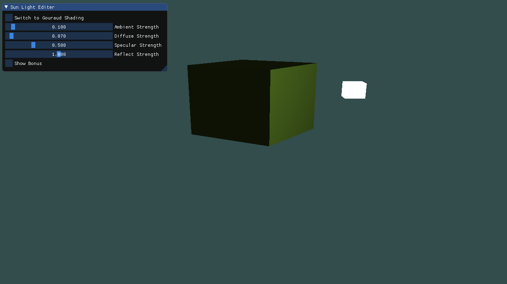

     * 升高(漫反射分量增强，导致光照效果迅速提升，结果有些许曝光)

       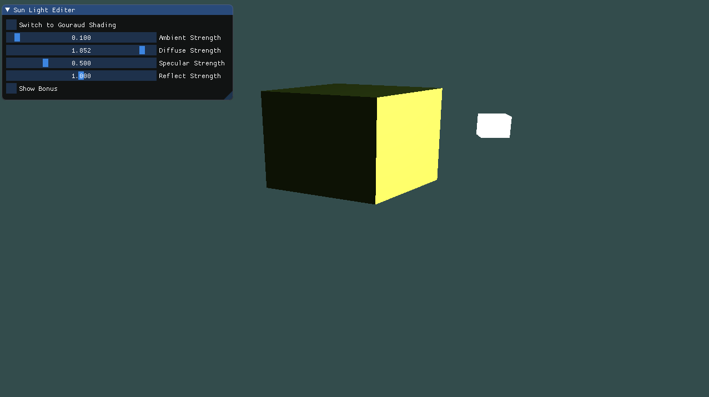

  3. 镜面反射因子`specular Strength`

     * 降低

       

     * 升高

       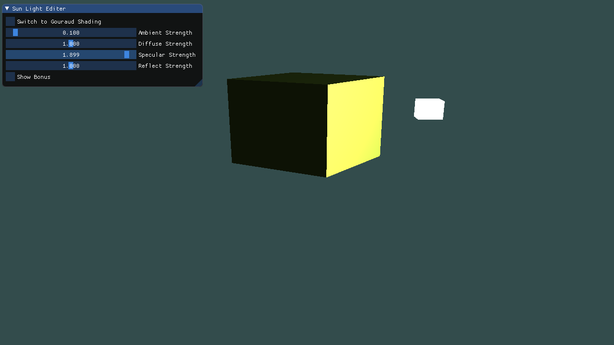

     ​


> Bonus 部分

## 六、 使光源在场景中移动，光照效果实时更改

* 使得光源在场景中移动，只需要结合`glfwGetTime()`获取当前时间，动态改变`lightPos`的位置即可。此处设置光源模型围绕y轴进行公转，同时为了表现出光照效果，令物体模型在`y-z`方向上进行自转。

  ```c++
  if (showBonus) {
      lightPos.x = sin(glfwGetTime()) * 5.0f;
      lightPos.z = cos(glfwGetTime()) * 5.0f;
      model = glm::rotate(model, (float)glfwGetTime() * 1.5f, glm::vec3(0.0f, 1.0f, 1.0f));
  }
  ```

  ​

* 结果如下：

  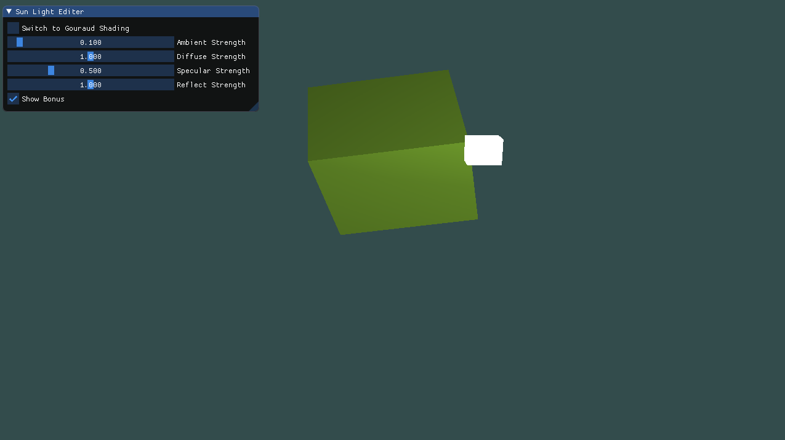