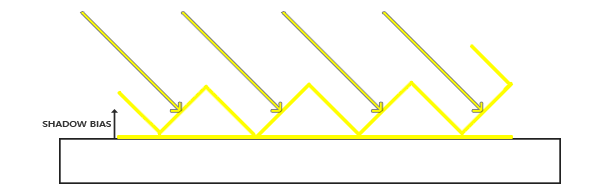
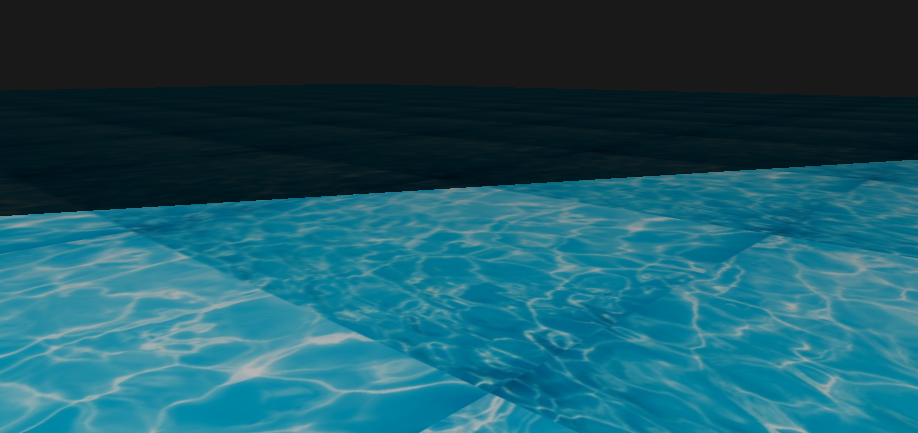
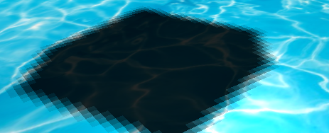

# 计算机图形学 - Homework 7


### 姓名：陈明亮

### 学号：16340023


> Basic 部分

## 一、 进行场景中的平面和物体绘制(用于显示shadow)
* 结合前面几次作业绘制正方体的过程，此步骤我们需要定义平面和所需的正方体顶点数组，决定两者的位置属性：

  ```c++
  // Define plane vertices
  GLfloat vertices[] = {
  	// Positions          // Normals       // Texture Coords
  	25.0f, -0.5f, 25.0f, 0.0f, 1.0f, 0.0f, 25.0f, 0.0f,
  	-25.0f, -0.5f, -25.0f, 0.0f, 1.0f, 0.0f, 0.0f, 25.0f,
  	-25.0f, -0.5f, 25.0f, 0.0f, 1.0f, 0.0f, 0.0f, 0.0f,

  	25.0f, -0.5f, 25.0f, 0.0f, 1.0f, 0.0f, 25.0f, 0.0f,
  	25.0f, -0.5f, -25.0f, 0.0f, 1.0f, 0.0f, 25.0f, 25.0f,
  	-25.0f, -0.5f, -25.0f, 0.0f, 1.0f, 0.0f, 0.0f, 25.0f
  };
  ```

  ```c++
  // Define cube vertices
  GLfloat vertices[] = {
      // Back face
      -0.5f, -0.5f, -0.5f, 0.0f, 0.0f, -1.0f, 0.0f, 0.0f, // Bottom-left
      0.5f, 0.5f, -0.5f, 0.0f, 0.0f, -1.0f, 1.0f, 1.0f, // top-right
      0.5f, -0.5f, -0.5f, 0.0f, 0.0f, -1.0f, 1.0f, 0.0f, // bottom-right         
      0.5f, 0.5f, -0.5f, 0.0f, 0.0f, -1.0f, 1.0f, 1.0f,  // top-right
      -0.5f, -0.5f, -0.5f, 0.0f, 0.0f, -1.0f, 0.0f, 0.0f,  // bottom-left
      -0.5f, 0.5f, -0.5f, 0.0f, 0.0f, -1.0f, 0.0f, 1.0f,// top-left
      // Front face
      -0.5f, -0.5f, 0.5f, 0.0f, 0.0f, 1.0f, 0.0f, 0.0f, // bottom-left
      0.5f, -0.5f, 0.5f, 0.0f, 0.0f, 1.0f, 1.0f, 0.0f,  // bottom-right
      0.5f, 0.5f, 0.5f, 0.0f, 0.0f, 1.0f, 1.0f, 1.0f,  // top-right
      0.5f, 0.5f, 0.5f, 0.0f, 0.0f, 1.0f, 1.0f, 1.0f, // top-right
      -0.5f, 0.5f, 0.5f, 0.0f, 0.0f, 1.0f, 0.0f, 1.0f,  // top-left
      -0.5f, -0.5f, 0.5f, 0.0f, 0.0f, 1.0f, 0.0f, 0.0f,  // bottom-left
      // Left face
      -0.5f, 0.5f, 0.5f, -1.0f, 0.0f, 0.0f, 1.0f, 0.0f, // top-right
      -0.5f, 0.5f, -0.5f, -1.0f, 0.0f, 0.0f, 1.0f, 1.0f, // top-left
      -0.5f, -0.5f, -0.5f, -1.0f, 0.0f, 0.0f, 0.0f, 1.0f,  // bottom-left
      -0.5f, -0.5f, -0.5f, -1.0f, 0.0f, 0.0f, 0.0f, 1.0f, // bottom-left
      -0.5f, -0.5f, 0.5f, -1.0f, 0.0f, 0.0f, 0.0f, 0.0f,  // bottom-right
      -0.5f, 0.5f, 0.5f, -1.0f, 0.0f, 0.0f, 1.0f, 0.0f, // top-right
      // Right face
      0.5f, 0.5f, 0.5f, 1.0f, 0.0f, 0.0f, 1.0f, 0.0f, // top-left
      0.5f, -0.5f, -0.5f, 1.0f, 0.0f, 0.0f, 0.0f, 1.0f, // bottom-right
      0.5f, 0.5f, -0.5f, 1.0f, 0.0f, 0.0f, 1.0f, 1.0f, // top-right         
      0.5f, -0.5f, -0.5f, 1.0f, 0.0f, 0.0f, 0.0f, 1.0f,  // bottom-right
      0.5f, 0.5f, 0.5f, 1.0f, 0.0f, 0.0f, 1.0f, 0.0f,  // top-left
      0.5f, -0.5f, 0.5f, 1.0f, 0.0f, 0.0f, 0.0f, 0.0f, // bottom-left     
      // Bottom face
      -0.5f, -0.5f, -0.5f, 0.0f, -1.0f, 0.0f, 0.0f, 1.0f, // top-right
      0.5f, -0.5f, -0.5f, 0.0f, -1.0f, 0.0f, 1.0f, 1.0f, // top-left
      0.5f, -0.5f, 0.5f, 0.0f, -1.0f, 0.0f, 1.0f, 0.0f,// bottom-left
      0.5f, -0.5f, 0.5f, 0.0f, -1.0f, 0.0f, 1.0f, 0.0f, // bottom-left
      -0.5f, -0.5f, 0.5f, 0.0f, -1.0f, 0.0f, 0.0f, 0.0f, // bottom-right
      -0.5f, -0.5f, -0.5f, 0.0f, -1.0f, 0.0f, 0.0f, 1.0f, // top-right
      // Top face
      -0.5f, 0.5f, -0.5f, 0.0f, 1.0f, 0.0f, 0.0f, 1.0f,// top-left
      0.5f, 0.5f, 0.5f, 0.0f, 1.0f, 0.0f, 1.0f, 0.0f, // bottom-right
      0.5f, 0.5f, -0.5f, 0.0f, 1.0f, 0.0f, 1.0f, 1.0f, // top-right     
      0.5f, 0.5f, 0.5f, 0.0f, 1.0f, 0.0f, 1.0f, 0.0f, // bottom-right
      -0.5f, 0.5f, -0.5f, 0.0f, 1.0f, 0.0f, 0.0f, 1.0f,// top-left
      -0.5f, 0.5f, 0.5f, 0.0f, 1.0f, 0.0f, 0.0f, 0.0f // bottom-left        
  };
  ```

  ​

* 对于平面的渲染绘制，我们在顶点数组中定义每个关键顶点的位置坐标，法向量坐标，以及贴图位置。新建平面顶点缓冲对象和顶点数组对象，进行缓冲数据的绑定和绘制：

  ```c++
  GLuint plane_VBO;
  // Set Up plane VAO
  glGenVertexArrays(1, &plane_VAO);
  glBindVertexArray(plane_VAO);
  // Set Up plane VBO
  glGenBuffers(1, &plane_VBO);
  glBindBuffer(GL_ARRAY_BUFFER, plane_VBO);
  glBufferData(GL_ARRAY_BUFFER, sizeof(vertices), &vertices, GL_STATIC_DRAW);
  // Bind Vertex Array
  glEnableVertexAttribArray(0);
  glVertexAttribPointer(0, 3, GL_FLOAT, GL_FALSE, 8 * sizeof(GLfloat), (GLvoid*)0);
  glEnableVertexAttribArray(1);
  glVertexAttribPointer(1, 3, GL_FLOAT, GL_FALSE, 8 * sizeof(GLfloat), (GLvoid*)(3 * sizeof(GLfloat)));
  glEnableVertexAttribArray(2);
  glVertexAttribPointer(2, 2, GL_FLOAT, GL_FALSE, 8 * sizeof(GLfloat), (GLvoid*)(6 * sizeof(GLfloat)));
  glBindVertexArray(0);
  ```

  ​

* 进行正方体的绘制，整体流程与绘制平面的过程相同：

  ```c++
   glGenVertexArrays(1, &cube_VAO);
   glGenBuffers(1, &cube_VBO);
   // Fill buffer
   glBindBuffer(GL_ARRAY_BUFFER, cube_VBO);
   glBufferData(GL_ARRAY_BUFFER, sizeof(vertices), vertices, GL_STATIC_DRAW);
   // Link vertex attributes
   glBindVertexArray(cube_VAO);
   glEnableVertexAttribArray(0);
   glVertexAttribPointer(0, 3, GL_FLOAT, GL_FALSE, 8 * sizeof(GLfloat), (GLvoid*)0);
   glEnableVertexAttribArray(1);
   glVertexAttribPointer(1, 3, GL_FLOAT, GL_FALSE, 8 * sizeof(GLfloat), (GLvoid*)(3 * sizeof(GLfloat)));
   glEnableVertexAttribArray(2);
   glVertexAttribPointer(2, 2, GL_FLOAT, GL_FALSE, 8 * sizeof(GLfloat), (GLvoid*)(6 * sizeof(GLfloat)));
   glBindBuffer(GL_ARRAY_BUFFER, 0);
   glBindVertexArray(0);
  ```

  ​

* 初步实现的场景物体摆放

  

  ​


## 二、 实现方向光源的Shadowing Mapping

* 阴影映射`Shadow Mapping`背后的思路非常简单：首先选择光源所在的位置为视角进行渲染，按照阴影产生的原理，我们所能看到的东西能被点亮，而反之看不到的部分则处在阴影之中。 

  容易想到的解决思路是：对光源发出的射线上的点进行遍历，并记录第一个与物体相交的点。如果在这条光射线上的点比这个交点距离光源的距离更远，那么较远的点处在阴影之中。 

  但是在渲染过程中逐一对不同方向上的射线、同一射线上的无数个点进行计算比较显然是不切实际的，所以考虑开启深度测试，使用深度测试的方法来简化实现的过程。 

  ​

  这里我们考虑从光源的透视图来渲染场景，并将深度值的结果存储在纹理之中——也就是说，对光源的透视图所见的最近的深度值进行采样，所得到的这个深度值就是我们在光源的角度下透视图能够见到的第一个片元。所有的这些深度值被称作深度贴图`depthMap` 

  


  阴影渲染两大基本步骤：

  1. 以光源视角渲染场景，得到深度图`depthMap`，并存储为`texture`；

  2. 以`camera`视角渲染场景，使用`Shadowing Mapping`算法(比较当前深度值与在`depthMap texture`的深度值)，决定某个点是否在阴影下。 

     ​


1. 第一步：深度贴图的获取

   在之前的作业中，我们已经了解过众多类型的帧缓冲对象，包括：用于写入颜色值的颜色缓冲、用于写入深度信息的深度缓冲和允许我们根据一些条件来丢弃特定片段的模板缓冲。所有的这些缓冲结合起来叫做帧缓冲`Frame Buffer`

   紧接着，对于场景深度贴图的存储，我们需要将其放置在纹理对象中，所以首先需申请帧缓冲对象`FBO`存放`depthMap`：

   ```c++
   // Define Depth Map FBO
   GLuint depthMap_FBO;
   glGenFramebuffers(1, &depthMap_FBO);
   ```

   其次仍需要为深度贴图的`FBO`对象进行附件属性的配置，由于本次作业只考虑深度，所以将纹理的格式指定为`GL_DEPTH_COMPONENT`，然后将生成的深度纹理作为帧缓冲的深度缓冲附加到帧缓冲上：

   ```c++
   // Bind Frame Buffer
   glBindFramebuffer(GL_FRAMEBUFFER, depthMap_FBO);
   glFramebufferTexture2D(GL_FRAMEBUFFER, GL_DEPTH_ATTACHMENT, GL_TEXTURE_2D, depthMap, 0);
   glDrawBuffer(GL_NONE);
   glReadBuffer(GL_NONE);
   glBindFramebuffer(GL_FRAMEBUFFER, 0);
   ```

   ​

   接下来需要生成深度贴图，生成的过程为：

   1. 从光源角度进行深度缓冲的渲染，首先需要对场景的顶点、片段着色器进行配置。以光的透视图进行场景渲染的时候，顶点着色器把顶点变换到光空间。

      ```c++
      // Vertex Shader
      #version 330 core
      layout (location = 0) in vec3 position;

      uniform mat4 lightSpaceMatrix;
      uniform mat4 model;

      void main()
      {
          gl_Position = lightSpaceMatrix * model * vec4(position, 1.0f);
      }
      ```

      顶点着色器将一个单独模型的一个顶点，使用lightSpaceMatrix变换到光空间中。

      由于我们没有颜色缓冲，最后的片元不需要任何处理，所以我们可以简单地使用一个空片段着色器：

      ```c++
      #version 330 core

      void main()
      {             
          // gl_FragDepth = gl_FragCoord.z;
      }
      ```

      ​

      在主程序中，需要传入对应的光源位置，光源投影，将计算结果矩阵`lightSpaceMatrix`传入着色器中。此处的光源投影模式已经实现`Bonus`，通过控制`lightProjection`，即可以手动切换正交投影\透视投影两种模式。

      ```c++
      glm::mat4 lightProjection, lightView;
      glm::mat4 lightSpaceMatrix;
      if (mode) {
          lightProjection = glm::perspective(glm::radians(45.0f) * 10, (GLfloat)SHADOW_WIDTH / 										(GLfloat)SHADOW_HEIGHT, near_plane, far_plane);
      }else {
          lightProjection = glm::ortho(-10.0f, 10.0f, -10.0f, 10.0f, near_plane, far_plane);
      }
      lightView = glm::lookAt(lightPos, glm::vec3(0.0f), glm::vec3(0.0, 1.0, 0.0));
      lightSpaceMatrix = lightProjection * lightView;

      glUseProgram(depthShaderID);
      glUniformMatrix4fv(glGetUniformLocation(depthShaderID, "lightSpaceMatrix"), 1, GL_FALSE, glm::value_ptr(lightSpaceMatrix));
      ```

      ​

   2. 将渲染结果存储为深度贴图

      存储过程十分简单，只需要绑定`FBO`对象，以及对应的`Texture`对象即可。

      ```c++
      glViewport(0, 0, SHADOW_WIDTH, SHADOW_HEIGHT);
      glBindFramebuffer(GL_FRAMEBUFFER, depthMap_FBO);
      glClear(GL_DEPTH_BUFFER_BIT);
      glActiveTexture(GL_TEXTURE0);
      glBindTexture(GL_TEXTURE_2D, textureID);
      ```

      ​

   ​

2. 第二步：深度贴图的渲染

   正确地生成深度贴图以后我们就可以开始生成阴影了。通过修改相应的主世界渲染的像素着色器，用来检验一个片元是否在阴影之中，但首先我们需要做的是在顶点着色器中进行光源空间的转换：

   ```c++
   #version 330 core
   layout (location = 0) in vec3 position;
   layout (location = 1) in vec3 normal;
   layout (location = 2) in vec2 texCoords;

   out vec2 TexCoords;

   out VS_OUT {
       vec3 FragPos;
       vec3 Normal;
       vec2 TexCoords;
       vec4 FragPosLightSpace;
   } vs_out;

   uniform mat4 projection;
   uniform mat4 view;
   uniform mat4 model;
   uniform mat4 lightSpaceMatrix;

   void main()
   {
       gl_Position = projection * view * model * vec4(position, 1.0f);
       vs_out.FragPos = vec3(model * vec4(position, 1.0));
       vs_out.Normal = transpose(inverse(mat3(model))) * normal;
       vs_out.TexCoords = texCoords;
       vs_out.FragPosLightSpace = lightSpaceMatrix * vec4(vs_out.FragPos, 1.0);
   }
   ```

   在顶点着色器将世界空间顶点位置转换为光空间之后，顶点着色器传递一个普通的经变换的世界空间顶点位置`vs_out.FragPos`和一个光空间的`vs_out.FragPosLightSpace`给片段着色器，使其计算出某一点的阴影值`shadow`，结合之前作业实现的`Phong`光照模型，完成阴影的渲染：

   ```c++
   void main()
   {           
       vec3 color = texture(diffuseTexture, fs_in.TexCoords).rgb;
       vec3 normal = normalize(fs_in.Normal);
       vec3 lightColor = vec3(1.0);
       // Ambient
       vec3 ambient = 0.15 * color;
       // Diffuse
       vec3 lightDir = normalize(lightPos - fs_in.FragPos);
       float diff = max(dot(lightDir, normal), 0.0);
       vec3 diffuse = diff * lightColor;
       // Specular
       vec3 viewDir = normalize(viewPos - fs_in.FragPos);
       vec3 reflectDir = reflect(-lightDir, normal);
       float spec = 0.0;
       vec3 halfwayDir = normalize(lightDir + viewDir);  
       spec = pow(max(dot(normal, halfwayDir), 0.0), 64.0);
       vec3 specular = spec * lightColor;    
       // 计算阴影
       float shadow = ShadowCalculation(fs_in.FragPosLightSpace);   
   	if(mode == 1){
   		shadow = 0;
   	}
       vec3 lighting = (ambient + (1.0 - shadow) * (diffuse + specular)) * color;    

       FragColor = vec4(lighting, 1.0f);
   }
   ```

   此处的`shadowCalculation()`对某点进行基于深度贴图的阴影值计算，在未进行算法优化之前，我们简单通过透视除法计算，算法步骤如下：

   1. 将裁切空间坐标的范围`-w`到`w`转为`-1`到`1`，这要将`x、y、z`元素除以向量的`w`元素来实现。
   2. 为了得到片元的当前深度，我们简单获取投影向量的`z`坐标，它等于来自光的透视视角的片元的深度，即取得最近点的深度。
   3. 实际的对比就是简单检查`currentDepth`是否高于`closetDepth`，如果是，那么片元就在阴影中。

   ```c++
   float ShadowCalculation(vec4 fragPosLightSpace)
   {
       // 执行透视除法
       vec3 projCoords = fragPosLightSpace.xyz / fragPosLightSpace.w;
       // 变换到[0,1]的范围
       projCoords = projCoords * 0.5 + 0.5;
       // 取得最近点的深度(使用[0,1]范围下的fragPosLight当坐标)
       float closestDepth = texture(shadowMap, projCoords.xy).r; 
       // 取得当前片元在光源视角下的深度
       float currentDepth = projCoords.z;
       // 检查当前片元是否在阴影中
       float shadow = currentDepth > closestDepth  ? 1.0 : 0.0;

       return shadow;
   }
   ```

   ​

3. 第三步：完成阴影渲染

   最后，在主程序中，我们需要对着色器用到的各项参数进行传递，包括当前光源的位置，相机的参数等，然后绑定当前的深度贴图，以及场景用到的深度贴图。

   ```c++
   // Step Two. Render scene as normal
   glViewport(0, 0, SCR_WIDTH, SCR_HEIGHT);
   glClear(GL_COLOR_BUFFER_BIT | GL_DEPTH_BUFFER_BIT);
   glUseProgram(shaderID);

   glm::mat4 projection = glm::perspective(camera.Zoom, (float)SCR_WIDTH / (float)SCR_HEIGHT, 0.1f, 100.0f);
   glm::mat4 view = camera.GetViewMatrix();
   glUniformMatrix4fv(glGetUniformLocation(shaderID, "projection"), 1, GL_FALSE, glm::value_ptr(projection));
   glUniformMatrix4fv(glGetUniformLocation(shaderID, "view"), 1, GL_FALSE, glm::value_ptr(view));
   // Set light uniforms
   glUniform3fv(glGetUniformLocation(shaderID, "lightPos"), 1, &lightPos[0]);
   glUniform3fv(glGetUniformLocation(shaderID, "viewPos"), 1, &camera.Position[0]);
   glUniformMatrix4fv(glGetUniformLocation(shaderID, "lightSpaceMatrix"), 1, GL_FALSE, glm::value_ptr(lightSpaceMatrix));
   glUniform1i(glGetUniformLocation(shaderID, "mode"), close_shadow?1:0);
   glActiveTexture(GL_TEXTURE0);
   glBindTexture(GL_TEXTURE_2D, textureID);
   glActiveTexture(GL_TEXTURE1);
   glBindTexture(GL_TEXTURE_2D, depthMap);
   RenderScene(shaderID);
   ```

   初步的阴影渲染情况为：

   


   可以看到整体场景的渲染效果较差，出现了下面这些问题：

   1. 阴影失真，场景出现了较多不必要的条纹。
   2. 阴影锯齿，平面上的阴影有很多的锯齿。
   3. 采样过多，光的视锥不可见的区域一律被认为是处于阴影中，不管它真的处于阴影之中。

   在`Bonus`部分将会针对上述缺点进行算法上的优化。


## 三、修改GUI，实现对阴影显示的控制

此处的`GUI`增加了对阴影的开启/关闭选项，以及正交投影的参数控制，也为`Bonus`部分的投影方式切换，和摄像机移动选项进行了添加：

```c++
{
    ImGui::Begin("Shadow Mapping Editer");
    ImGui::SliderFloat("Near Plane", &near_plane, 0.0f, 5.0f);
    ImGui::SliderFloat("Far Plane", &far_plane, 5.0f, 10.0f);
    ImGui::Checkbox("Close Shadow", &close_shadow);

    ImGui::Text("\n");

    ImGui::Text("Bonus");
    ImGui::Checkbox("Switch To Perspective Projection Mode", &mode);
    ImGui::Checkbox("Enable Movement", &enable_move);

    ImGui::End();
}
```


> Bonus 部分

## 四、 实现光源在正交/透视两种投影下的Shadowing Mapping

* 两种不同投影方式的切换，只需要通过调整`lightProjection`的生成方式即可，对于正交投影：

  ```c++
  lightProjection = glm::ortho(-10.0f, 10.0f, -10.0f, 10.0f, near_plane, far_plane);
  ```

  对于透视投影：

  ```c++
  lightProjection = glm::perspective(glm::radians(45.0f) * 10, (GLfloat)SHADOW_WIDTH / (GLfloat)SHADOW_HEIGHT, near_plane, far_plane);
  ```

  ​

* 切换模式通过`ImGui`的选项实现：

  ```c++
  ImGui::Checkbox("Switch To Perspective Projection Mode", &mode);
  ```


## 五、 优化Shadowing Mapping

1. 优化阴影失真问题

   在前面的渲染结果中，我们可以看到地板四边形渲染出很大一块交替黑线：

   

   这种情况叫做：阴影失真，导致问题出现的原因为：

   * 因为阴影贴图受限于解析度，在距离光源比较远的情况下，多个片元可能从深度贴图的同一个值中去采样。图片每个斜坡代表深度贴图一个单独的纹理像素。你可以看到，多个片元从同一个深度值进行采样。
   * 多个片元就会从同一个斜坡的深度纹理像素中采样，有些在地板上面，有些在地板下面；这样我们所得到的阴影就有了差异。因为这个，有些片元被认为是在阴影之中，有些不在，由此产生了图片中的条纹样式。

   

   解决方法：**阴影偏移**`shadow bias`。简单地对表面的深度（或深度贴图）应用一个偏移量，这样片元就不会被错误地认为在表面之下了。使用了偏移量后，所有采样点都获得了比表面深度更小的深度值，这样整个表面就正确地被照亮，没有任何阴影。

   

   ```c++
   float bias = max(0.05 * (1.0 - dot(normal, lightDir)), 0.005);
   float shadow = currentDepth - bias > closestDepth  ? 1.0 : 0.0;
   ```

   改进之后的场景显示为：

   

   ​

2. 优化悬浮问题

   使用阴影偏移的一个缺点是你对物体的实际深度应用了平移。偏移有可能足够大，以至于可以看出阴影相对实际物体位置的偏移。

   这个阴影失真叫做悬浮`Peter Panning`，我们可以使用一个叫技巧解决大部分的Peter panning问题：当渲染深度贴图时候使用正面剔除（front face culling）

   因为我们只需要深度贴图的深度值，对于实体物体无论我们用它们的正面还是背面都没问题。使用背面深度不会有错误，因为阴影在物体内部有错误我们也看不见。

   

   为了修复peter游移，我们要进行正面剔除，先必须开启GL_CULL_FACE：

   ```c++
   glCullFace(GL_FRONT);
   RenderScene(depthShaderID);
   glCullFace(GL_BACK);
   ```

   ​

3. 优化阴影锯齿问题

   可以看到，结果场景的渲染阴影往往有较大的锯齿，因为深度贴图有一个固定的解析度，多个片元对应于一个纹理像素。结果就是多个片元会从深度贴图的同一个深度值进行采样，这几个片元便得到的是同一个阴影，这就会产生锯齿边。

   我们采用`PCF - Percentage Closer Filtering`方法对阴影锯齿进行优化，算法步骤为：

   * 从深度贴图中多次采样，每一次采样的纹理坐标都稍有不同。
   * 所有的次生结果接着结合在一起，进行平均化，我们就得到了柔和阴影
   * 一个简单的PCF的实现是简单的从纹理像素四周对深度贴图采样，然后把结果平均起来。

   核心的代码为：

   ```c++
   // PCF
   float shadow = 0.0;
   vec2 texelSize = 1.0 / textureSize(shadowMap, 0);
   int FilterSize = 1;

   // PCF
   for(int x = -FilterSize; x <= FilterSize; ++x)
   {
       for(int y = -FilterSize; y <= FilterSize; ++y)
       {
           float pcfDepth = texture(shadowMap, projCoords.xy + vec2(x, y) * texelSize).r; 
           shadow += currentDepth - bias > pcfDepth  ? 1.0 : 0.0;        
       }    
   }
   shadow /= (FilterSize * 2 + FilterSize) * (FilterSize * 2 + FilterSize);
   ```

   对纹理坐标进行偏移，确保每个新样本，来自不同的深度值。这里采样得到9个值，它们在投影坐标的`x`和`y`值的周围，为阴影阻挡进行测试，并最终通过样本的总数目将结果平均化。

   采用`PCF`方法优化之后的整体阴影显示为：

   

   ​

4. 优化采样过多问题

   在场景渲染中还有一个问题，即光的视锥不可见的区域一律被认为是处于阴影中，不管它真的处于阴影之中。出现这个状况是因为超出光的视锥的投影坐标比1.0大，这样采样的深度纹理就会超出他默认的0到1的范围。根据纹理环绕方式，我们将会得到不正确的深度结果，它不是基于真实的来自光源的深度值。

   解决方法为：

   * 让所有超出深度贴图的坐标的深度范围是1.0，这样超出的坐标将永远不在阴影之中。
   * 我们可以储存一个边框颜色，然后把深度贴图的纹理环绕选项设置为`GL_CLAMP_TO_BORDER`

   核心代码为：

   ```c++
   glTexParameteri(GL_TEXTURE_2D, GL_TEXTURE_WRAP_S, GL_CLAMP_TO_BORDER);
   glTexParameteri(GL_TEXTURE_2D, GL_TEXTURE_WRAP_T, GL_CLAMP_TO_BORDER);
   GLfloat borderColor[] = { 1.0, 1.0, 1.0, 1.0 };
   glTexParameterfv(GL_TEXTURE_2D, GL_TEXTURE_BORDER_COLOR, borderColor);
   ```

   但是，我们发现仍有一部分是黑暗区域。那里的坐标超出了光的正交视锥的远平面，导致这部分黑暗区域看起来很突兀：

   

   当一个点比光的远平面还要远时，它的投影坐标的z坐标大于1.0。这种情况下，`GL_CLAMP_TO_BORDER`环绕方式不起作用，因为我们把坐标的`z`元素和深度贴图的值进行了对比；它总是为大于`1.0`的`z`返回`true`。

   解决这个问题也很简单，只要投影向量的z坐标大于1.0，我们就把shadow的值强制设为0.0：

   ```c++
   // Keep the shadow at 0.0 when outside the far_plane region of the light's frustum.
       if(projCoords.z > 1.0)
           shadow = 0.0;
   ```

   设定之后，光的远平面下的场景也会被照亮：

   

   ​

   ​

5. 优化`PCF`方法对阴影锯齿的不足

   由于之前采用的存储深度贴图大小为`1024 X 1024`，导致摄像头移动到阴影近处时，常常出现明显的锯齿现象(在PCF优化之后)，这种现象的原因在于存储阴影贴图的`Size`过小，导致构建整体深度图所用上的像素点数量低，渲染结果必会出现明显的锯齿：

   


   改进方法为：适当地提升存储深度缓冲贴图的大小，此处设置为：

   ```c++
   const unsigned int SHADOW_WIDTH = 8428;
   const unsigned int SHADOW_HEIGHT = 8428;
   ```

   改进之后，在相同角度观察阴影，所得结果为：

   

   可以看到结果阴影的锯齿情况改善了很多。

   ​

经过一系列优化之后，全体场景的效果图为：

