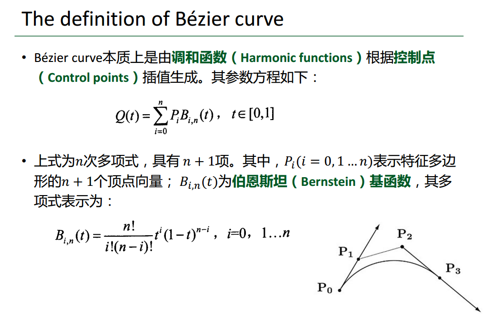
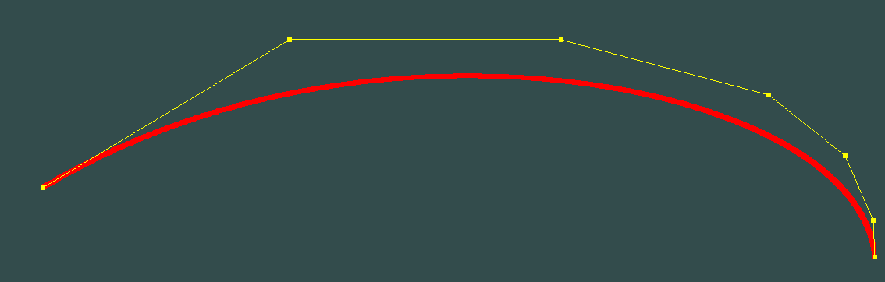
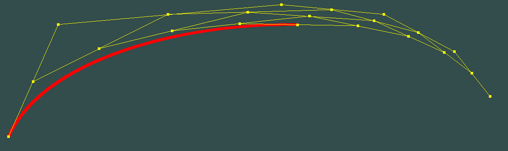
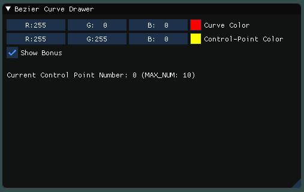
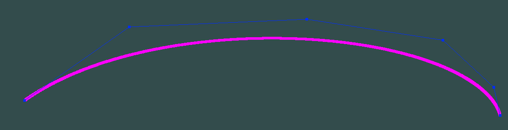
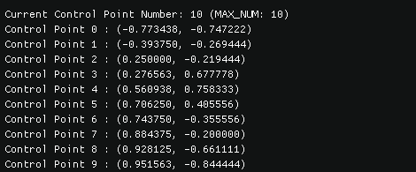

# 计算机图形学 - Homework 8


### 姓名：陈明亮

### 学号：16340023


> Basic 部分

## 一、实现左键点击窗口，添加Bezier曲线的控制点

1. 为了使得用户能够通过鼠标左键点击屏幕，`OpenGL`窗口能够响应该操作并且能够在正确位置添加控制点，首先需要实现`MouseButtonCallBack`回调函数，并注册该回调函数：

   ```c++
   glfwSetMouseButtonCallback(window, MouseButtonCallBack);
   ```

   `MouseButtonCallBack`函数原型为：

   ```c++
   void MouseButtonCallBack(GLFWwindow* window, int button, int action, int mods);
   ```

   其中，`window`参数表示当前注册的窗口，`button`参数表示用户在鼠标上按下的按键类型，`action`参数表示用户对鼠标作出的行为类型。

   对用户点击鼠标左键的行为判断逻辑为：

   ```c++
   if(action == GLFW_PRESS) {
   	if(button == GLFW_MOUSE_BUTTON_LEFT) {
   		// Process
   	}
   }
   ```

   在该条件判断中，我们需要正确获取到用户鼠标所在位置，因此须结合`glfwGetCursorPos()`函数，获取相对于当前窗口的鼠标坐标，函数原型为：

   ```c++
   void glfwGetCursorPos(GLFWwindow* window, double& xCur, double& yCur);
   ```

   通过传入`(x, y)`坐标值的引用，我们便可以获取鼠标点在窗口上的位置，但是此处不能直接使用该点坐标进行绘制，需要通过坐标的正规化转换，将其变换为`OpenGL`坐标下的点，才能继续之后的点绘制工作：

   ```c++
   xCur = (xCur - WINDOW_WIDTH / 2) / (WINDOW_WIDTH / 2);
   yCur = (-yCur + WINDOW_HEIGHT / 2) / (WINDOW_HEIGHT / 2);
   ```

   该坐标转换过程对应于两大步骤：

   1. 首先分别对`(x, y)`执行减法运算，将其`x`坐标的范围缩减到`(-WINDOW_WIDTH / 2, WINDOW_WIDTH / 2)`返回内，`y`坐标需要进行符号变换(由于`OpenGL`世界坐标特性)，范围缩减到`(-WINDOW_HEIGHT / 2, WINDOW_HEIGHT/ 2)`
   2. 然后分别除以对应的分母，将坐标归一化，最终缩放到`(-1, 1)`之间，也就是正确的`OpenGL`世界坐标。


2. 上述过程使得程序能够正确地读取用户左键点击屏幕的行为，同时也计算出了正确的点击坐标，接下来的工作则是存储相应的控制点坐标，同时在渲染循环内部进行控制点线的绘制。

   定义`Point`结构体存储点坐标：

   ```c++
   struct Point {
   	double x;
   	double y;
   	Point() {}
   	Point(double x_, double y_) {
   		this->x = x_;
   		this->y = y_;
   	}
   };
   ```

   设定最大可添加控制点数，同时定义存储控制点的`vector`：

   ```c++
   #define MAX_CONTROL_NUM 10

   vector<Point> ControlPoints;
   ```

   在上述左键点击，获取鼠标点击坐标后，在控制点数量满足条件的前提下，将相关控制点存入`vector`中：

   ```c++
   if(button == GLFW_MOUSE_BUTTON_LEFT) {
       double xCur, yCur;
       int point_num = ControlPoints.size();
       if(point_num < MAX_CONTROL_NUM) {
           // Add a new Control Point
           glfwGetCursorPos(window, &xCur, &yCur);
           // Normalize cursor position
           xCur = (xCur - WINDOW_WIDTH / 2);
           yCur = (-yCur + WINDOW_HEIGHT / 2);
           // New the control point
           ControlPoints.push_back(Point(xCur, yCur));
       }
   }
   ```

   我们将控制点坐标的归一化放置到之后的操作中，交给`Normalize()`函数执行归一化操作：

   ```c++
   float Normalize(int raw, bool mode) {
   	int fractor = mode ? SCR_HEIGHT / 2 : SCR_WIDTH / 2;
   	return float(raw) / fractor;
   }
   ```

   ​

   ​

3. 在主渲染循环中，通过存储控制点的`vector`，对负责绘制控制点和控制线的数组进行坐标的赋值，具体的赋值操作函数如下：

   ```c++
   void SetControlPoints(int point_num) 
   {
   	int _offset = 0;
   	// Set control points
   	for (int i = 0; i < point_num; i++) {
   		control_points[_offset++] = Normalize(ControlPoints[i].x, false);
   		control_points[_offset++] = Normalize(ControlPoints[i].y, true);
   		control_points[_offset++] = 0.0f;
   		// Set Color
   		control_points[_offset++] = ctrl_color.x;
   		control_points[_offset++] = ctrl_color.y;
   		control_points[_offset++] = ctrl_color.z;
   	}
   	// Set control lines
   	_offset = 0;
   	for (int i = 0; i < point_num; i++) {
   		int iter_time = 1;
   		if (i > 0 && i < MAX_CONTROL_NUM-1) {
   			iter_time = 2;
   		}
   		for (int k = 0; k < iter_time; k++) {
   			control_lines[_offset++] = Normalize(ControlPoints[i].x, false);
   			control_lines[_offset++] = Normalize(ControlPoints[i].y, true);
   			control_lines[_offset++] = 0.0f;
   			// Set Color
   			control_lines[_offset++] = ctrl_color.x;
   			control_lines[_offset++] = ctrl_color.y;
   			control_lines[_offset++] = ctrl_color.z;
   		}
   	}
   }
   ```

   其中，`control_points`是负责绘制控制点的数组，`control_lines`是负责绘制控制线的数组，此处的`ctrl_color`是`glm::vec3`类型变量，负责控制绘制的控制点线的颜色。

   执行完坐标数组的赋值操作之后，我们需要回到渲染主循环，执行绘制过程的顶点数据绑定，启用绘制数组等等操作：

   ```c++
   // Render Control Points
   if (ControlPoints.size() > 0) {
       glBindBuffer(GL_ARRAY_BUFFER, VBO);
       glBufferData(GL_ARRAY_BUFFER, sizeof(control_points), control_points, GL_STATIC_DRAW);
       // Bind Location
       glVertexAttribPointer(0, 3, GL_FLOAT, GL_FALSE, 6 * sizeof(float), (void*)0);
       glEnableVertexAttribArray(0);
       // Bind Color
       glVertexAttribPointer(1, 3, GL_FLOAT, GL_FALSE, 6 * sizeof(float), 
                             (void*)(3 * sizeof(float)));
       glEnableVertexAttribArray(1);
       glDrawArrays(GL_POINTS, 0, ControlPoints.size());
       // Draw Lines
       glBufferData(GL_ARRAY_BUFFER, sizeof(control_lines), control_lines, GL_STATIC_DRAW);
       // Bind Location
       glVertexAttribPointer(0, 3, GL_FLOAT, GL_FALSE, 6 * sizeof(float), (void*)0);
       glEnableVertexAttribArray(0);
       // Bind Color
       glVertexAttribPointer(1, 3, GL_FLOAT, GL_FALSE, 6 * sizeof(float), 
                             (void*)(3 * sizeof(float)));
       glEnableVertexAttribArray(1);
       glDrawArrays(GL_LINES, 0, 2 * (ControlPoints.size() - 1));
   }
   ```

   ​

4. 至此，我们对控制点的接收和初步绘制已经完成，但初期的工作还有一项，那就是定义并链接程序使用的着色器程序，此处我们使用到的着色器程序只需要简单地显示二维平面点即可，不需要执行而外的逻辑。

   ```c++
   // Vertex Shader
   #version 330 core

   // Input vertex data, different for all executions of this shader.
   layout (location = 0) in vec3 Position;
   layout (location = 1) in vec3 inColor;

   // Output one color to fragment shader
   out vec3 outColor;

   void main(){
       gl_Position = vec4(Position, 1.0);
       outColor = inColor;
   }
   ```

   ```c++
   // Fragment Shader
   #version 330 core

   // Ouput data
   out vec4 oColor;

   // Input data
   in vec3 outColor;

   void main(){
   	oColor = vec4(outColor, 1.0);
   }
   ```

   链接着色器程序：

   ```c++
   // Create and compile our GLSL program from the shaders
   GLuint programID = LoadShaders("shader.vs", "shader.fs");

   glUseProgram(programID);
   ```

   ​


## 二、实现右键点击窗口，对添加的最后一个控制点消除

在上一步完成的基础上，我们需要对用户鼠标右键点击进行响应，这一步只需要添加`MouseButtonCallBack`的逻辑判断即可：

```c++
if(action == GLFW_PRESS) {
	if(button == GLFW_MOUSE_BUTTON_LEFT) {
		// Left - Process
	}
	else if(button == GLFW_MOUSE_BUTTON_RIGHT && LastAddPoints.size() > 0) {
        // Right - Process
	}
}
```

此处的`LastAddPoints`对应于用户之前添加的控制点`vector`，并且按照存储的顺序，`LastAddPoints`内部存储的元素，越靠近末尾的元素则越是更新添加的控制点。为了实现此些逻辑，我们还需要在左键点击时，也对`LastAddPoints`进行控制点的添加：

```c++
LastAddPoints.push_back(Point(xCur, yCur));
```

在右键的点击逻辑中，我们需要先判断当前窗口中还有至少一个控制点`LastAddPoints.size() > 0`，然后针对于`LastAddPoints`最后一位控制点的信息，到`ControlPoints`内部获取到对应的相同点，执行`erase`操作，删除最新添加的控制点：

```c++
// Delete Last Adding Control Point
for(int i = 0; i < ControlPoints.size(); i++) {
    if(ControlPoints[i].x == LastAddPoints.back().x 
       && ControlPoints[i].y == LastAddPoints.back().y) 
    {
        ControlPoints.erase(ControlPoints.begin() + i);
        LastAddPoints.pop_back();
        break;
    }
}
```


## 三、根据绘制的控制点，实时生成不同的Bezier曲线

1. 完成鼠标窗口的响应逻辑之后，我们的工作回归到生成`Bezier`曲线的本身，故需要首先熟悉如何根据各个控制点，获取不同`step`下，`Bezier`曲线上的点坐标：

   

   根据课件上的算法原理，`Bezier`曲线生成的步骤可以分为以下几步:

   1. 首先根据当前步长`step`，计算出伯恩斯坦基函数的各项数值

   2. 然后对当前的控制点进行基于`x`坐标的排序，做到`P0, P1, P2, ....., Pn`必定是从左到右排列的

   3. 根据以上结果，分别对`x, y`坐标计算调和函数的值，返回当前步长对应的`Bezier`曲线上的点坐标

      ​

   伯恩斯坦基函数的计算过程，只需要按照公式来即可，代码如下：

   ```c++
   // Define Frac Funtion
   int frac(int source) {
   	if (source == 0)
   		return 1;

   	for (int i = source-1; i >= 1; i--) {
   		source *= i;
   	}

   	return source;
   }
   ```

   ```c++
   // Calculate Bernstein
   int point_num = ControlPoints.size();
   float* B = new float[point_num];

   for (int i = 0; i < mode; i++) {
   	B[i] = frac(n) / (frac(i) * frac(n - i)) * pow(step, i) * pow((1 - step), n - i);
   }
   ```

   ​

   控制点基于`x`坐标的排序，此处使用了简单实现的冒泡排序，如下：

   ```c++
   void SortControlPoints()
   {
   	for(int i = 0; i < ControlPoints.size(); i++) {
   		for(int j = i+1; j < ControlPoints.size(); j++) {
   			if(ControlPoints[i].x > ControlPoints[j].x) {
   				Point temp = ControlPoints[i];
   				ControlPoints[i] = ControlPoints[j];
   				ControlPoints[j] = temp;
   			}
   		}
   	}
   }
   ```

   ​

   最终计算调和函数的值，根据当前控制点坐标，返回`Bezier`曲线上的计算结果坐标点：

   ```c++
   // Resulting the points' location
   float xpos = 0.0f, ypos = 0.0f;
   for (int i = 0; i <= n; i++) {
       xpos += ControlPoints[i].x * B[i];
       ypos += ControlPoints[i].y * B[i];
   }
   ```

   ​

2. 上一步完成了在对应步长`step`下，针对任意的控制点`vector`，计算曲线上某一点的算法。接下来我们需要对曲线生成过程的每一步长，求解对应的坐标点，同时将坐标存储到负责渲染点的数组`points`中，交由渲染步骤进行操作。

   ```c++
   if(point_num <= MAX_CONTROL_NUM && point_num >= 2) {
       // Sort Control Points by X-axis
       SortControlPoints();
       for(float step = 0.0; step <= 1.0; step += STEP) {
           Point temp = getBezier(ControlPoints, step);
           points[offset++] = Normalize(temp.x, false);
           points[offset++] = Normalize(temp.y, true);
           points[offset++] = 0.0f;
           // Set Color
           points[offset++] = line_color.x;
           points[offset++] = line_color.y;
           points[offset++] = line_color.z;
       }
   }
   ```

   此处的`line_color`也是用于控制`Bezier`曲线的颜色向量，会在之后的`Bonus`部分使用到(动态修改曲线颜色)。完成曲线点数组的赋值之后，曲线点计算函数会返回当前绘制到的最后一个点的坐标，用于辅助渲染代码正确地完成渲染步骤：

   ```c++
   // Directly and Staticly Draw Bezier Curve
   curr_offset = GetCurrentCurvePoints();

   // Render main Bezier Curve Points
   if (curr_offset > 0) {
       glBindBuffer(GL_ARRAY_BUFFER, VBO);
       glBufferData(GL_ARRAY_BUFFER, sizeof(points), points, GL_STATIC_DRAW);
       glVertexAttribPointer(0, 3, GL_FLOAT, GL_FALSE, 6 * sizeof(float), (void*)0);
       glEnableVertexAttribArray(0);
       glVertexAttribPointer(1, 3, GL_FLOAT, GL_FALSE, 6 * sizeof(float), 
                             (void*)(3 * sizeof(float)));
       glEnableVertexAttribArray(1);
       glDrawArrays(GL_POINTS, 0, curr_offset / 6);
   }
   ```

   增大绘制点的大小：

   ```c++
   glPointSize(6.0f);
   ```

   ​

   ​

3. `Basic`部分完成效果：

   


> Bonus 部分

## 四、实现Bezier曲线的动态生成过程

1. 实现`Bezier`曲线的动态生成过程，实际上分为两大步骤：

   * 生成`Bezier`曲线的整体生成过程的逐帧动画效果
   * 生成`Bezier`曲线调和过程中，涉及到的曲线调和控制点的移动动画效果

   首先我们考虑曲线本身的动态生成过程进行处理，实际上实现过程十分简单，只需要全局化当前曲线绘制的进度：

   ```c++
   float percent = 0.0f;
   ```

   在每一次获取`Bezier`曲线上的所有点时，以当前绘制进度作为上限边界，同时在每一次获取操作之后，绘制进度加上一个单位的提升：

   ```c++
   for (float step = 0.0; step <= percent; step += 0.001) {
       Point temp = getBezier(ControlPoints, step);
       points[offset++] = Normalize(temp.x, false);
       points[offset++] = Normalize(temp.y, true);
       points[offset++] = 0.0f;
       // Set Color
       points[offset++] = line_color.x;
       points[offset++] = line_color.y;
       points[offset++] = line_color.z;
   }
   // Set unit as 0.001
   percent += 0.001;
   ```

   在绘制完成之后，防止曲线绘制操作的重复执行：

   ```c++
   if (showBonus) {
       if (percent >= 1.0f) {
          	// Static Getting the whole Bezier Curve Points
           curr_offset = GetCurrentCurvePoints();
       }
       else {
           // Dynamic showing the generation of Bezier Curve
           curr_offset = GetBezierCurveAtTime();
       }
   }
   ```

   可以很清楚的看到，我们将动态生成与静态生成的函数分为两个：`GetBezierCurveAtTime()`, `GetCurrentCurvePoints()`，当绘制进度达到`100%`时，默认执行静态绘制过程。

   ​


2. 添加`Bezier`曲线生成过程中，各个曲线调和控制点的移动动画，我们需要先了解调和点的生成步骤：
   * 控制点从左到右，两点连成控制线，根据当前的步长`step`，取每一条控制线上的调和点，此处设为$P^1_i$，位于控制线$C_nC_{n+1}$上

   * 根据贝塞尔曲线的切线定理，不同控制点两两连成的直线上，调和点的位置满足以下性质：
     $$
     \frac{C_nP^1_i}{P^1_iC_{n+1}} = Step
     $$

   * 根据此性质生成一阶调和点集，两两之间再次连成直线，再进行多阶调和点的坐标求解，迭代过程的结束标志为：当前阶的调和点个数为1，$Size(P^k) =1$，最终的调和点比例公式为：
     $$
     \frac {C_1P^1_1} {P^1_1C_2} = \frac {C_2P^1_2} {P^1_2C_3} = \;........\;= \frac {C_{n-1}P^k_1} {P^k_1C_n} = Step
     $$


   ​

3. 根据以上算法，逐层生成每一阶的调和点并记录其坐标位置，生成的规则为：记录当前作为参照，连成线的各点坐标`edge_points`，结合比例公式计算生成的调和点，在一轮迭代结束之后，更改`edge_points`为此轮生成的调和点集，直到最后剩余一个点(即为贝塞尔曲线上的点)，迭代结束。

   ```c++
   // Init the Edge Points as the Control Points
   for (int i = 0; i < point_num; i++) {
       edge_points.push_back(ControlPoints[i]);
   }
   ```

   ```c++
   while (iter_time--) {
       // Adding animation points
       int pre_size = animation_points.size(), after_size = -1;
       for (int i = 0; i <= iter_time; i++) {
           double xpos = percent * edge_points[i + 1].x + (1 - percent) * edge_points[i].x,
           ypos = percent * edge_points[i + 1].y + (1 - percent) * edge_points[i].y;
           animation_points.push_back(Point(xpos, ypos));
       }
       after_size = animation_points.size();

       // Reset Edge Points
       edge_points.clear();
       vector<Point>().swap(edge_points);
       for (int i = pre_size; i < after_size; i++) {
           edge_points.push_back(animation_points[i]);
       }
   }
   ```

   最后不要忘记把对应的点坐标转换成数组内部的各点坐标，用于绘制顶点和曲线：

   ```c++
   // Set the animation points location array
   int _offset = 0;
   for (int i = 0; i < animation_points.size(); i++) {
       bezier_points[_offset++] = Normalize(animation_points[i].x, false);
       bezier_points[_offset++] = Normalize(animation_points[i].y, true);
       bezier_points[_offset++] = 0.0f;
       // Set Color
       bezier_points[_offset++] = ctrl_color.x;
       bezier_points[_offset++] = ctrl_color.y;
       bezier_points[_offset++] = ctrl_color.z;
   }
   ```

   ```c++
   // Set the animation lines location array
   _offset = 0;
   int cal_num = point_num - 1, temp = cal_num - 1;
   bool ignore_next = false;

   for (int i = 0; i < animation_points.size(); i++) {
       int iter_time = 1;
       if (i > 0 && i < animation_points.size() - 1) {
           if (i == cal_num - 1) {
               cal_num += temp;
               temp--;
               ignore_next = true;
           }
           else {
               if (!ignore_next) {
                   iter_time = 2;
               }

               ignore_next = false;
           }
       }
       for (int k = 0; k < iter_time; k++) {
           bezier_lines[_offset++] = Normalize(animation_points[i].x, false);
           bezier_lines[_offset++] = Normalize(animation_points[i].y, true);
           bezier_lines[_offset++] = 0.0f;
           // Set Color
           bezier_lines[_offset++] = ctrl_color.x;
           bezier_lines[_offset++] = ctrl_color.y;
           bezier_lines[_offset++] = ctrl_color.z;
       }
   }
   ```

   转换成线坐标需要做额外的操作，因为只有不位于调和点集合两侧的内部点，需要在绘制曲线时，加入`bezier_line`两次，保证线段的正确生成。

   ​

4. 动态生成`Bezier`曲线的截图：

   


## 五、添加ImGui控件，记录控制点位置，提供更改曲线颜色的功能

1. 添加`ImGui`控件，增加切换曲线和顶点颜色的编辑功能，以及`Bonus`的切换功能：

   ```c++
   ImGui::ColorEdit3("Curve Color", (float*)&line_color);
   ImGui::ColorEdit3("Control-Point Color", (float*)&ctrl_color);

   ImGui::Checkbox("Show Bonus", &showBonus);
   ImGui::Text("\n");
   ```

   记录生成的控制点的位置，显示控制点最多绘制十个的信息(理论上可以绘制无数个控制点，此处为了显示的友好性和实际需求，设置了最大限制数)

   ```c++
   // Dynamic show control points location
   string cp_number = "Current Control Point Number: " + to_string(ControlPoints.size()) 
       + " (MAX_NUM: " + to_string(MAX_CONTROL_NUM) + ")";
   ImGui::Text(cp_number.c_str());
   for (int index = 0; index < ControlPoints.size(); index++) {
       string ctrl_text = "Control Point " + to_string(index) + " : ";
       ctrl_text += "(";
       ctrl_text += to_string(Normalize(ControlPoints[index].x, false));
       ctrl_text += ", ";
       ctrl_text += to_string(Normalize(ControlPoints[index].y, true));
       ctrl_text += ")";
       ImGui::Text(ctrl_text.c_str());
   }
   ImGui::Text("\n");
   ```

   ​

2. `ImGui`窗口的展示效果：

   

   ​

   切换曲线和顶点颜色：

   

   ​

   查看控制点位置：

   