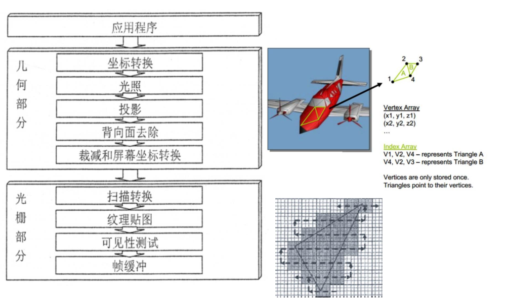

# Review_1-4

## Chapter One - Introduction

1. 计算机图形学的用途?
   * 电影：动画，特效，表演捕捉

   * 电脑游戏

    * 可视化：地理，医学成像

    * 训练和模拟

    * 广告，设计和艺术

    * UI设计，CAD-CAM和设计

      ​

2. 什么是计算机图形学?

   * 以像素为世界成像的科学和技术，使其提供真实的体验 - 看起来真实，听起来真实，感觉真实
    * 计算机图形 = 所有视觉内容的合成
         过程为：建模+渲染+处理+动画
         ​

3. 什么是交互式计算机图形学?

   * 用户通过快速的视觉反馈控制对象及其显示图像的内容，结构和外观

    * 交互式图形系统的基本组件：输入，处理，显示/输出

      ​

4. 计算机图形学的基础组件

   * 建模（形状和外观）：创建和表示3D世界中对象的几何。

    * 渲染（显示）：是从艺术继承的术语，用于处理从3D计算机模型创建2D阴影图像。

    * 动画（模拟）：描述对象如何随时间变化。

      ​

## Chapter Two - Computer Graphics System

1. 计算机图形学系统的组成：
   * 一个应用程序
    * 图形库
    * 图形硬件

2. RGB帧缓冲
   * 每个LCD元件的亮度由称为帧缓冲器的专用存储器阵列控制（缓冲器逐像素存储图像的内容）

    * 帧缓冲区的每个元素都与屏幕上的单个像素相关联。

    * 通常，显示器允许R，G和B中的每一个设置256个电压。

    * 我们有时将每个R，G和B组件称为通道（因此图像的“红色通道”仅为每个像素的R组件）

      ​

3. Alpha通道

   * 除图像的R，G和B通道外，添加第四个通道，称为α（透明度/不透明度/半透明度）
    * Alpha在0和1之间变化，值1表示完全不透明像素，而值0表示完全透明像素
      ​

4. 物理成像系统

   * 眼睛（生物学）
    * 相机：电影（化学），数字（物理+数字）
    * 成像原理
      ​

5. What is an image? [什么是图像]

   * 我们可以将图像看作是从 $R^2$ 到 $R$的一个函数:

     1. `f(x, y)` 给出位置`(x, y)`处的通道强度

     2. 实际上，我们希望图像只能在矩阵上定义，即有限范围内:
        $$
        f: [a, b] \times [c, d] \rightarrow [0, 1]
        $$
        ​

   * 彩色图像可以由以下向量形式表示: 
        $$
        f(x, y)=\begin{bmatrix} r(x,y) \\ g(x,y) \\ b(x,y) \end{bmatrix}
        $$
        ​

   ​

6. What is a digital image? [什么是数字图像]

   * 在计算机图形学中，我们通常使用数字（离散）图像：

     1.在常规网格上对空间进行采样
     2.量化每个样本（舍入到最接近的整数）
     3.如果我们的样本相差Δ，我们可以将其写成：
     $$
     f[i,j] = Quantize{f(i\Delta, j\Delta)}
     $$
     ​

   ​

7. Modeling an Image

   * 将单通道m×n图像建模为函数`u(i,j)`，将整数对（像素坐标）映射到实数，并且是整数，使得`0≤i<m`且`0≤j<n`将每个像素值关联到显示周围的小区域坐标位置，此处的像素看起来像样本点上方的方形，但它只是一个标量值和屏幕的实际几何形状。

   * 外观因设备而异, `CRT`上的大致圆形斑点, `LCD`面板上的矩形。

     ​

8. 图像合成元素

   * 物体

   * 观察者

   * 光照

   * 光的属性，对象的材质：确定效果，光对象

     ​

9. 图形渲染管线

   * 渲染过程（图形管道）是什么？

     用于创建3D场景的2D栅格表示的步骤序列。

     

     ​

     ​

10. 顶点处理过程

   * 要绘制的对象的顶点在对象空间中（如模型在您的3D建模器中）
   * 转变为世界空间乘以它模型矩阵顶点，现在位于世界空间（用于定位所有的场景中的物体）
   * 变身为相机空间乘以它查看矩阵，顶点现在位于View Space中
   * 把它想象成你在寻找，通过“相机”现场
   * 转换成屏幕空间乘以它投影矩阵
   * 顶点现在位于屏幕空间 - 这实际上就是你所看到的你的显示器

   ​

## Chapter Three - Rasterization 

1. 什么是光栅化？[Rasterization]

   * 显示使用线条、多边形等基本体建模的世界的任务。填充/图案区域等可分两步进行：

     1. 确定原语可见的像素，过程称为光栅化或扫描转换
     2. 确定要分配给每个像素的颜色值

     ​

2. 扫描转换线段过程

   * 目标：在光栅化网格上，绘制从`(x1, y1)`点到`(x2, y2)`点的线段

   * 要求：

     1. 绘制线段上的像素点要求尽可能地接近理想的线段
     2. 像素点组成的序列需要尽可能地直 [Straight]
     3. 所有的线段具有常数量的亮度，不因为长度和方向而改变
     4. 线段起始点和结束点需要准确
     5. 绘制线段速度要足够快
     6. 能够支持不同宽度和绘制风格

   * 思考：

     1. 如何绘制直线？
        $$
        (x_1, y_1), (x_2, y_2) \rightarrow y=mx+b \\ \rightarrow  when\;x=x_1+1, y=?(rounding) \\ \rightarrow when\;x=x_1+i, y=?(rounding)
        $$
        ​

     2. 数值微分法 [Digital Differential Analyzer] (DDA)

        * 将直线的绘制考虑成方程的点坐标的求解，其中直线方程为：
          $$
          y_i = m*x_i+c \\ where \; m = \frac {y_2-y_1}{x_2-x_1}
          $$

        * 迭代绘制点坐标的规则为：
          $$
          x_i = x_{i-1} + 1 \\ y_i = y_{i-1} + m
          $$

        * 像素点的产生新坐标为：$[x_i, round(y_i)]$

        * 以上的算式只符合$\Delta x > \Delta y$情况，当$\Delta x < \Delta y$时，迭代规则变化为：
          $$
          x_i = x_{i-1} + 1/m \\ y_i = y_{i-1} + 1
          $$

        * DDA运行速度慢，逻辑简单但质量不佳

          ​

     3. 布兰森汉姆算法 [Bresenham's Algorithm]

        - 最佳的直线近似绘制算法

        - DDA忽略了历史像素点的选择信息，而Bresenham算法能够充分利用信息约束，确定下一像素点的位置。

        - Bresenham算法根据判别标准(Criteria)进行下一个坐标点的抉择，其中可选的坐标点有：
          $$
          Upper \; Point \rightarrow (x_{i+1}, y_{i}+1) \\ Lower \; Point \rightarrow (x_{i+1}, y_i)
          $$
          定义的直线方程为：
          $$
          y = m *x + B \\ m = \Delta y / \Delta x
          $$
          显然，对于下一坐标点的选择，需要分别根据`Upper`和`Lower`点到直线准确点的距离来定：
          $$
          d_{upper} = y_i + 1 - y_{i+1}  = y_i + 1 - m*x_{i+1} - B \\ d_{lower} = y_{i+1} - y_i = m*x_{i+1} + B - y_i
          $$
          如果$d_{upper} > d_{lower}$，选择Lower点，反之选择Upper点

          为了使符号不变，同时消去不必要的项，我们此处定义变量`p`，作为算法判别标准的核心变量：
          $$
          p_i = \Delta x * (d_{lower} - d_{upper}) = \Delta x * (2m*(x_i+1)-2*y_i+2B-1)
          $$
          其中$m=\Delta y / \Delta x$，化简之后获得：
          $$
          p_i = 2\Delta y * (x_i+1) - 2\Delta x * y_i + (2B-1) * \Delta x \\ =2\Delta y * x_i - 2\Delta x * y_i + c \\ Where \; c = (2B - 1) * \Delta x + 2*\Delta y
          $$
          所以当$p_i > 0$时，我们选择Upper点，否则选择Lower点，同时根据起始点计算初始$p_0$的算式为：
          $$
          p_0 = 2\Delta y * x_0 - 2\Delta x * (m * x_0 + B) + c \\
          = -2\Delta x*B + (2B - 1) * \Delta x + 2 * \Delta y \\
          = 2\Delta y - \Delta x
          $$
          通过$p_i$推出$p_{i+1}$的过程为：
          $$
          p_{i+1} - p_i = 2\Delta y - 2\Delta x * (y_{i+1} - y_i)
          $$
          当$p_i <= 0$时，选择了Lower点，所以$y_{i+1}-y_I = 0$，故$p_{i+1} = p_i + 2\Delta y$

          否则，选择了Upper点，所以$y_{i+1} - y_i = 1$，故$p_{i+1} = p_i + 2\Delta y - 2\Delta x$

        ​

     4. Bresenham算法的总结

        * 绘制初始点$(x_0, y_0)$
        * 为之后的判定标准变量的计算做准备，计算$\Delta x, \Delta y, 2\Delta y, 2\Delta y - 2\Delta x, p_0 = 2\Delta y - \Delta x$
        * 如果$p_i <=0$，绘制Lower点$(x_i+1,y_i)$，同时推算出$p_{i+1} = p_i + 2\Delta y$
        * 如果$p_i > 0$，绘制Upper点$(x_i + 1, y_i+1)$，同时推算出$p_{i+1} = p_i + 2\Delta y - 2\Delta x$
        * 重复以上最后两步，直到绘制结束

3. 光栅化填充三角形

4. Bresenham算法如何绘制圆形

   ​

## Chapter Four - Transformation

1. 基本的几何元素

   * 几何研究N维物体之间的关系空间

     * 在计算机图形中，我们主要关注二维和三维空间中的对象。

   * 希望获得一组最小的几何图形，我们可以在此基础上构造复杂对象。

   * 三个基本几何元素

     * 标量

     * 向量

     * 点

       ​

2. 向量的内积(点积)
   $$
   a * b = |a||b|cos\alpha
   $$

   $$
   a = [x_a, y_a] \; b = [x_b, y_b] \\ a * b = [x_a * x_b + y_a * y_b]
   $$

   ​

   ​

3. 向量的外积(叉积)
   $$
   a \times b \rightarrow 
   \left|\begin{array}{aa}
   i & j & k \\
   u_x & u_y & u_z \\
   v_x & v_y & v_z
   \end{array} \right|
   $$
   为该矩阵的行列式求解结果，所以最终的叉乘结果为：
   $$
   \begin{bmatrix}  u_y * v_z - u_z * v_y \\ u_x * v_z - u_z * v_x \\ u_x * v_y - u_y * v_x  \end{bmatrix}
   $$
   ​

4. 齐次坐标

   * 四维齐次坐标的一般形式：

     $P = [x, y, z, w]^T$

     当w不为0时，我们可以获得三维点坐标，通过以下操作：
     $$

     $$

     $$
     x \leftarrow x/w,y \leftarrow y/w, z \leftarrow z/w
     $$

   ​

   * 齐次坐标是所有计算机图形系统的关键。
     1. 所有标准转换（旋转、缩放）可应用于4×4矩阵乘法。
     2. 硬件管道系统可应用于三维表示
     3. 对于正交投影，可以确保向量为w=0，确保点为w=1。
     4. 对于透视投影，需要特殊处理：透视分割

5. 向量的线性变换

   线性变换符合范式：
   $$
   \begin{bmatrix} x^{'} \\ y^{'}  \end{bmatrix} = \begin{bmatrix}  a & b \\ c & d \end{bmatrix} \begin{bmatrix} x \\ y   \end{bmatrix}
   $$
   ​

   * 剪切(Shearing)

     给定剪切矩阵：
     $$
     \begin{bmatrix} 1 & b \\ 0 & 1  \end{bmatrix}
     $$
     ​

   * 缩放(Scaling)

     给定缩放矩阵：
     $$
     \begin{bmatrix} a & 0 \\ 0 & d  \end{bmatrix}
     $$
     经过变换，向量变换过程为：
     $$
     x^{'} = a * x \\ y^{'} = d * y
     $$
     ​

     ​

   * 旋转(Rotating)

     给定旋转矩阵：
     $$
     \begin{bmatrix} cos(\theta) & -sin(\theta) \\ sin(\theta) & cos(\theta)  \end{bmatrix}
     $$
     ​

   * 翻转(Reflecting)

     给定翻转矩阵：
     $$
     \begin{bmatrix} -1 & 0 \\ 0 & 1  \end{bmatrix}
     $$
     ​