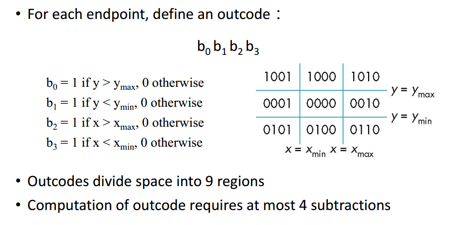
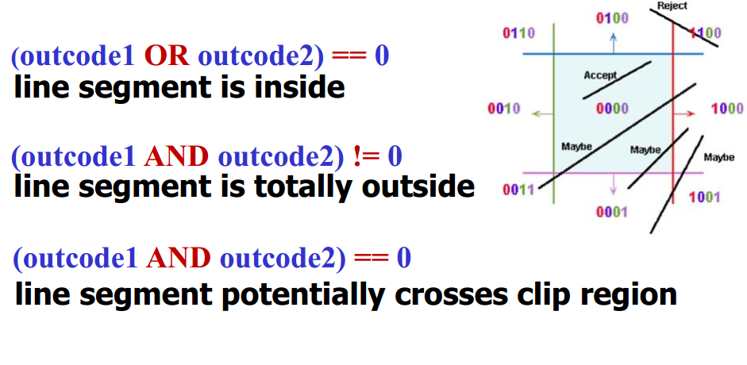

# Review 5-8

## Chapter Five - Viewing in 2D & 3D

## Chapter Six - Clipping & Hidden Surface Removal

1. 裁剪的时机

   基本体的剪切通常在扫描转换基本体之前完成。

   原因：扫描转换只需要处理原语的剪裁版本，该版本可能比其未剪裁版本小得多。

   ​

2. 如何进行裁剪？

   * 对于直线和多边形，裁剪难度低

   * 对于曲线和文本，裁剪难度高，所以可以考虑先将复杂的图形转换为规则的图形

   * 使用`OutCodes`进行线段位置检测：

     

     

## Chapter Seven - Lighting & Shading

## Chapter Eight - Shadow 